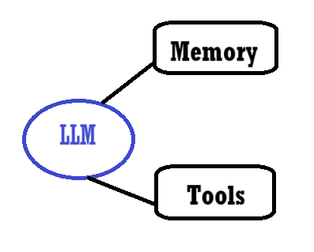
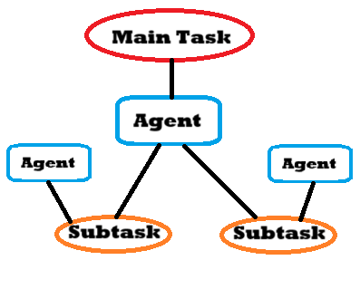
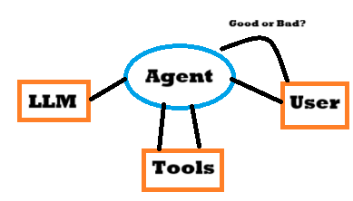

# Microsoft Developers Course on AI Agents

An introductory course on AI Agents, what those are and how to create one.
 
<a href="https://www.youtube.com/playlist?list=PLlrxD0HtieHgKcRjd5-8DT9TbwdlDO-OC">Youtube Link</a>
 
<a href="https://github.com/microsoft/ai-agents-for-beginners/tree/main">Github Repository</a>

## List of Content

- [1. What are AI Agents](#1-what-are-ai-agents)
- [2. How can AI Agents improve](#2-how-can-ai-agents-improve)
- [3. What are AI Agents Frameworks](#3-what-are-ai-agents-frameworks)
- [4. How to use a multi-AI Agent System](#4-how-to-use-a-multi-ai-agent-system)
- [5. What is Agentic RAG](#5-what-is-agentic-rag)
- [6. What is the AI Agent Planning design pattern](#6-what-is-the-ai-agent-planning-design-pattern)
- [7. How to build effective AI Agents](#7-how-to-build-effective-ai-agents)
- [8. How to deploy AI Agents into production](#8-how-to-deploy-ai-agents-into-production)
- [9. How to design good AI Agents](#9-how-to-design-good-ai-agents)
- [10. What is the Agent Tool use design pattern](#10-what-is-the-agent-tool-use-design-pattern)

## 1. What are AI Agents?

AI Agents mix a LLM, memory and tools to create a connection with the user in order how to deal and solve user tasks.
 
This first lesson shows the AI Agent parts and an overview of the code (that you can find on the above-mentioned Github repo).

- LLM: Large Language Model that can par our "reasoning", meaning it's able to identify a task and create a plan and actions to solve it.
- Memory: Collections of interactions between user and ai or data to improve Agent abilities.
- Tools: Functions or API calls that we use to send information to our Agent.

## 2. How can AI Agents improve?

This chapter explains what is Metacognition, sumarizing it as the process of saving and storing user preferences and adding more informations as the conversation goes on.
 
So the "memory" of the AI Agent must always be filled with new information and also, it must be re-called for each interaction to make the AI Agent always pertinent with the context of the message.
 
Some code examples are shown too, to explain an interaction by a user that wants to book a flight and the AI Agent that asks questions and saves informations.

## 3. What are AI Agents Frameworks?

AI Agents Frameworks are tools or connections that help us manage and have control over our AI Agent(s). This will also help on deciding the best AI Agent to use for the given task.
 
The chapter focuses on three different Frameworks:
<li>Azure AI Agent Service: focuses on single Agent, best integrated with other Azure services</li>
<li>Semantic Kernel: for developer teams building Agents in production</li>
<li>Autogen: for better researches and testing</li>

Some brief coding explanations with these 3 frameworks are shown at the end of the video.

## 4. How to use a multi-AI Agent System

This chapter shows how to create and use many AI Agents together for a given task. 
 
You can setup different AI Agents, each one with a specific prompt of their goal, "experience" and function and create an AI manager that can make them go by turns and verify if the content is good and specific for the task.
 
In the code part, each AI Agent had a different prompt where the "manager" was prompted to make the bots answer in following turns and to check if the answers received were pertinent for the task.

## 5. What is Agentic RAG?

RAG, Retrieval Augmented Generation, enables LLM to receive a Query from an user and get relevant information from the database. That information will be added to the content to generate a better answer for that question or task.
 
In the code we see that some AI Agents had stored basic informations (from temperatures to Cities) and after the user content, they were prompted to check if the answer from the question was stored in their information (for example "what's the temperature in.." would prompt the AI Agent with stored temperatures to answer)

## 6. What is the AI Agent Planning design pattern?

This chapter describes the process that starts with the main task, passed by the main AI Agent. His role is to devide the task into different subtasks and pass each one to a different and specific AI Agent in order that the information can be answered correctly in the most efficient way.

## 7. How to build effective AI Agents

The goal is to create effective, repeatable prompts for every AI Agents. To do so it's often useful to use a System Message framework that can give the same variables to each Agent, each one with the specific informations of the bot.
 
In the code we can see that for example we can create some variables (like company, role) and pass each Agent these informations, setting them for the use of the Bot. In this way you can create efficient and repeatable prompts.

## 8. How to deploy AI Agents into production

In order to deploy efficient AI Agents you can create a system where the quality of the answers given by the Agent(s) have a quality measure (like good or bad) to reinforce the behaviour of the Agent for the next interactions.
 

 
In the code is shown a backup method to avoid sudden errors. For example, create a backup answer for the Agent if the searched page isn't available, so that the bot can search elsewhere instead of just returning an error.
This creates a good flow with every interaction and thus these AI Agents can be deployed since they can deal even with sudden errors.

## 9. How to design good AI Agents

Good AI Agents are made by three important principles:
<li>Space: the environment where the Agent works in. It must be easily accessible from the user (via UI or API) and what the bot is capable of.</li>
<li>Time: the long-term concept where the Agent operates on, with the history of past and relevant conversations.</li>
<li>Core: the control over the Agent, with feedbacks and other operations to optimize the uncertainity of the answers</li>

## 10. What is the Agent Tool use design pattern?

This chapter explains that in order to create an efficient AI Agent you have to use external services as well, such as calculators, API or functions. 
 
In this way you can program the Agent to access to these external tools to improve its capabilities and suggest a more accurate and elaborated answer.

 

# Conclusions

This short course covers the basic knowledge to create and use AI Agents. 
 
For more information and the coding part, you can access the official GitHub repository written above.