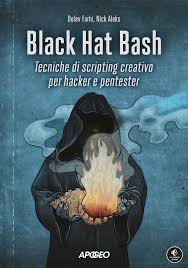

# Black Hat Bash - Book
**Black Hat Bash** is a great book, written by D. Farhi and N. Aleks, about penetration testing with Bash and Kali Linux. A guide that follows you from basic to advanced topics.

### Table of Contents
- [Chapter 1. The Bash Shell](#chapter-1-the-bash-shell)

## Step-By-Step Learning

### Chapter 1. The Bash Shell

This first chapter starts with an introduction of the Bash Shell with its common methods. 
 
The book teaches how to create scripts with various functions (like receive input or writing in the files).
 
At the end of the chapter there is a simple exercise.
 
You can find some exercises in 
[Files/Chapter1](files/chapter1)