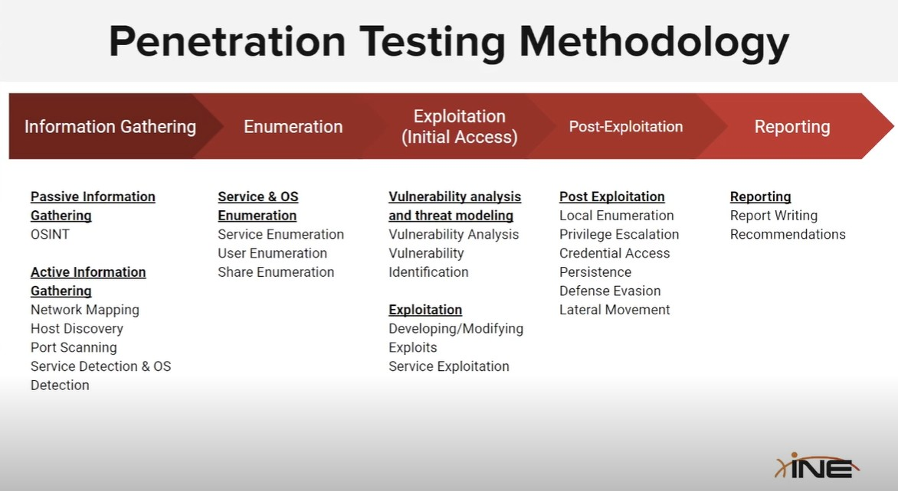
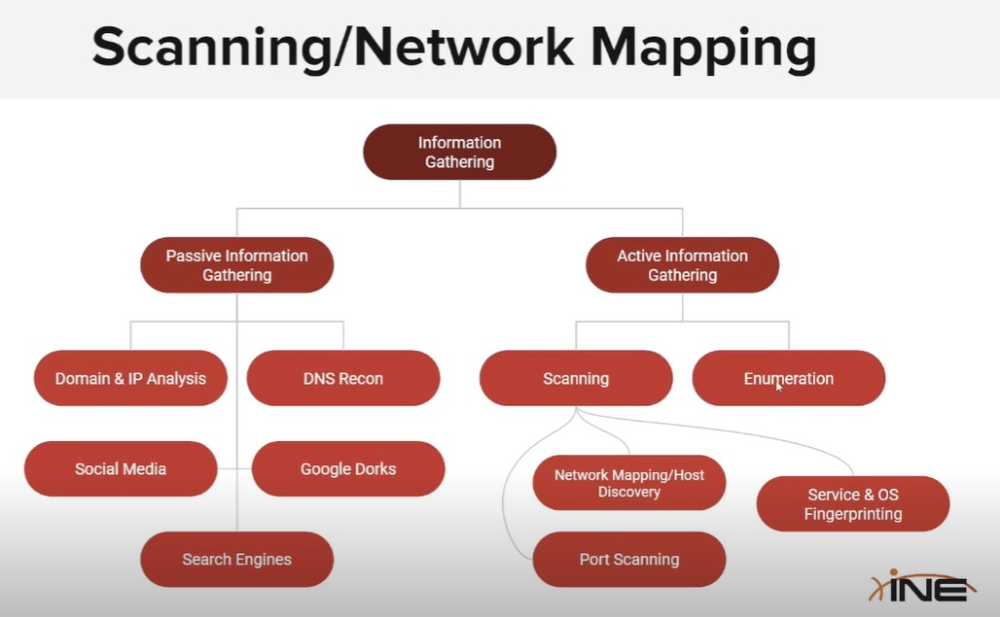
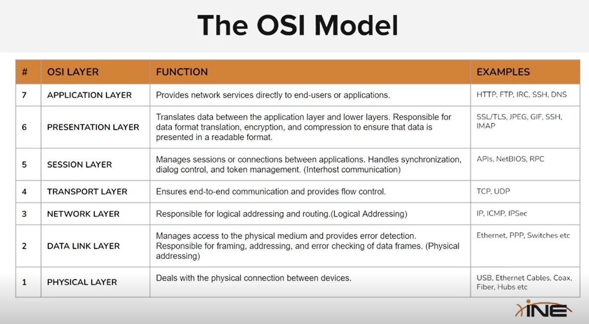
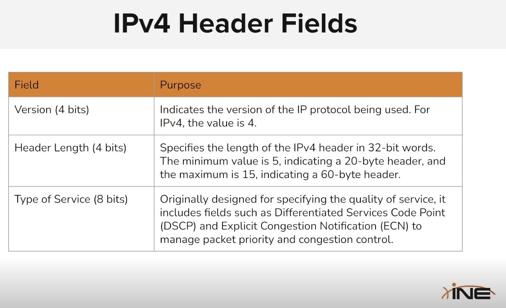
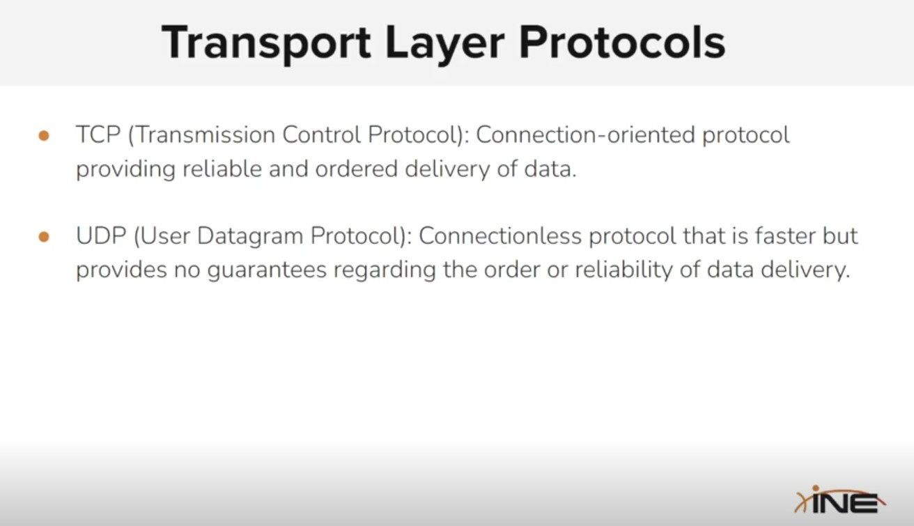
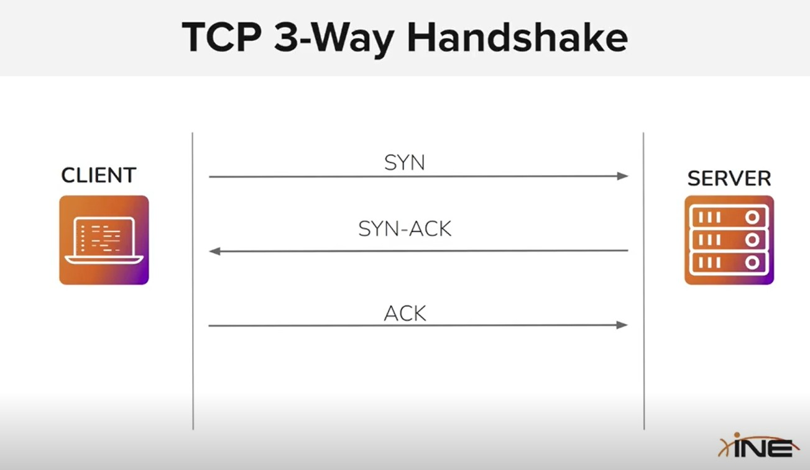
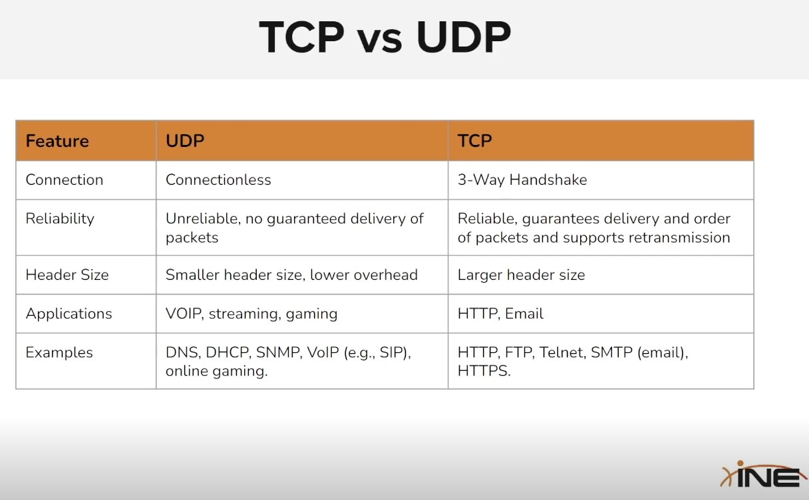
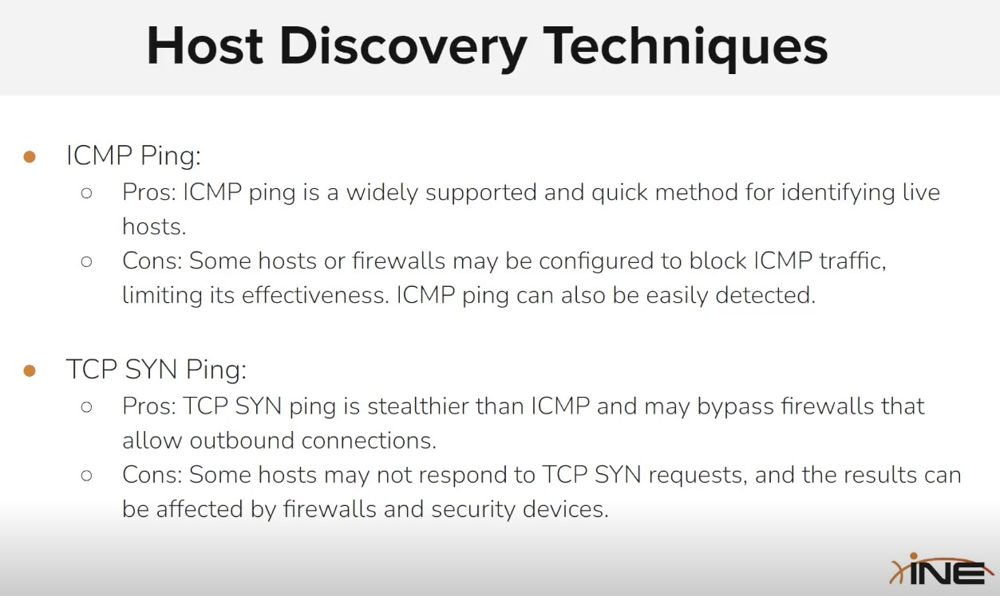

# Chapter 1 - Assessment Methodologies Information Gathering

The first chapter explains Passive and Active Information Gathering.

## Types of gathering information
<li>Passive Gathering: Access to public information, either with browser (user experience) or general tools</li>
<li>Active Gathering: Gain insights on informations without using publicly available tools or methods (for example using bruteforce)</li>

## Passive Gathering Methods & Tools

<li>"website url"/robots.txt: file that may show informations</li>
<li>Command: host "website url": gain ip and other info</li>
<li>Command: whois "website url or ip": gain informations</li>
<li>Command: whatweb "website url": get info about server, ip, etc</li>
<li>HttTrack: download the website to analyze it's source code</li>
<li>NetCraft: gain informations like emails, operating system, technologies..</li>

### DNS recon

<li>DNSRecon: tool used to gain informations like email server, technologies, ips..</li>
You can use it with dnsrecon -d "website url"
<li>DNSDumpster: web tool to analyze a website and gain insights.</li>

### Firewall recon

<li>Wafw00f: a tool (you can find it on GitHub) to gain insights about the firewall of a website.</li>

### Subdomain enumeration 

<li>Sublist3r: a passive-gathering tool that gains access to the subdomains of a website. It will find every publicly available domains using search engines (like Google, etc).</li>
sublister -d "website url" -e "search engine(s)"
<li>Google Dorks: some google commands to find informations of a specific target.</li>
You can limit the Google search by targeting a specific website or url.
<br><br>
This will search for everything that starts with your search, thus searching for subdomains too.
<br>
<li>site:"browser search"  (example: site:ine.com will search for every url that has ine.com, like ine.com/blog etc)</li>

<br>
You can add the inurl to search for a specific argument inside the url.
<br>
<li>site:ine.com inurl:admin (this will search for every url that starts with ine.com and contains admin)</li>

<br>
You can search everything that ends with the url.
<br>
<li>site:*.ine.com (this will search for every url that finishes with ine.com, like courses.ine.com)</li>

<br>
You can use the intitle to search for a title.
<br>
<li>site:*.ine.com intitle:admin</li>

<br>
You can search by file types as well using filetype.
<li>site:*.ine.com filetype:pdf</li>

<br>
You can finish your "google query" with another search without commands
<li>site:ine.com courses</li>

<br>
Some easy methods to try to find some vulnerabilities such as websites that have shown passwords by error.
<li>inurl:auth_user_file.txt</li> 
<li>inurl:password.txt</li>

<br>
You can find many available Passive Gathering Google Dorks here:
<li>Google Hacking Database (exploit-db.com)</li>

### Website timemachine

You can see how a website looked years ago with the WayBack Machine (web.archive.org)

<br>

### Email Harvesting

TheHarvester is a tool for email enumerating.
<br>
This tool has both Passive and Active Gathering methods to search for vulnerable emails.
<li>theHarvester -d "website url" -b "google, linkedin" (-b is to search for a particular website platform)</li>

<br>

### Leaked Password Databases

There are different websites that allows to check if a password has been leaked from different websites.
<br>
Some of them are:
<li>haveibeenpwned.com</li>

<br>

## Active Gathering Methods and Tools

### DNS Zone Transfer

DNS (Domain Name System) is a protocol to resolve website names to ip addresses.
<li>dnsenum is a tool for active gathering, enumerating subdomains, providers, servers, files, etc</li>
<li>dig is another tool for active gathering</li>
<li>fierce is another tool, that can also enable brute force to find subdomains</li>

### Host Discovery with Nmap

Nmap is a tool for port-scanning and active information gathering. 
<br>
You can use it to search for subdomains of a website.
<br>
(Alternatively you can use Netdiscover, that does the same but using an ARP method instead)
<br>
<li>sudo nmap -sn "ip address": this command will show every ip address linked to a particolar ip</li>

### Port Scanning with Nmap

After you have discovered some ips of an host you can perform a port scanning, with Nmap tool.
<br>
To summarize, you can do:
<li>nmap "ip address": to scan the open ports of that ip (NB: if it's a Windows ip, sometimes you can use the nmap -Pn command instead)</li>
<li>nmap -p "port(s)" "ip address": optional to scan only certain port(s)</li>
<li>nmap -sV "ip address": scan the ports and their service version running</li>
<li>nmap -O "ip address": scan the operating system too</li>
<li>nmap -sC "ip address": scan more informations of the ports</li>
<li>nmap -T"number from 0 to 4" "ip address": scan faster or slower</li>
You can finish the command with -oN or -oX to save the results in a file (example a text) or a xml file.

### Gobuster

You can find a list of available urls with Gobuster.
<li>gobuster dir -u "website url" -w /usr/share/wordlists/dirb/common.txt</li>


### LAB 1

In the first lab we had to explore a website and gather informations. There were 5 "flags" to capture.


# Chapter 2 - Assessment Methodologies: Footprinting & Scanning

This course starts by showing a simple roadmap of Penetration Testing Methologies.



### Active Information Gathering

Phase were the tester actively interacts with the target system or network to collect data and it's done with methods beyond the passive gathering such as: scanning, probing and direct interaction.



### Network Fundamentals

Network Protocols ensure that different hosts (computer systems) can communicate with each other.
<br>
The communication between different hosts is done by exchanging packets.
<br>

**Packets** are stream of bits of electric signals used for data transmission (through ethernet, wifi, ecc).
<br>
Every packet has an header (the information about the protocol used and the data transferred) and a payload (the data).
<br>

**OSI (Open Systems Interconnection) Model** is a conceptual framework that standarizes the telecommunication functions into seven abstract layers.



### Network Layer

The Network Layer (3) is responsible for logical addressing, addressing and forwarding data packets between different devices
<br>
It's goal is to determine the optimal path to travel from the source to the destination on separate networks too. That's why it is so important and thus grants what today we call "internet".
<br>
Several protocols operate on the Network Layer:
<li>Internet Protocol (IP), like iPv4 and iPv6: grants the foundation of the internet</li>
<li>Internet Control Message Protocol (ICMP): used for error reporting and diagnostics (including ping, traceroute)</li>
<li>Dynamic Host Configuration Protocol (DHCP): dynamically assign IP address to devices on a network, simplyfing the process of network configuration.</li>



### Transport Layer

The transport layer facilitates communication between *two* different devices in different networks.
<br>
The two main protocols of the transport layer are:
<li>TCP (Transmission Control Protocol): connection protocol, provides reliable and ordered data</li>
<li>UDP (User Datagram Protocol): connectionless protocol, faster but less reliable</li>



**TCP** Protocol ensures a connection between two different devices (such as client and server) *before* the data is exchanged.
<br>
This means that both the devices know "who" the other is before starting the data exchange.
<br>
For example, when you open a website for an HTTP connection, a TCP connection is also created to ensure that the HTTP connection can work in a reliable way.
<br>
In TCP, data is delivered in the correct order and there is a mechanism to retransmit lost or damaged packets.



This ensures that the connection is reliable.
<br>
Before an HTTP request, the client sends a packet with a flag "syn" (Syncronized) to the server. It will answer with another packet with the "syn-ack" (Acknowledgement) flag. Lastly the client sends a packet with the flag "ack".
<br>
These packets have some important flags to ensure control: SYN - ACK - FIN (Finish), each one can be either "set" or "clear".

**TCP Port Protocols**
There are well-known ports for certain protocols, such as:
<li>80: HTTP</li>
<li>443: HTTPS</li>
<li>21: TCP</li>
<li>22: SSH</li>
<li>25: SMTP</li>
<li>110: POP3</li>

<br>
<br>

**UDP** Protocol is connectionless, meaning that no connection is created between the two devices and there isn't a persistent state mantained and there isn't a mechanism to retransmit lost or damaged packets too.
<br>
UDP is primarly used for streaming (like audio, video or gaming) or VoIP communication.




### Network Mapping

Network mapping is the active gathering process to find hosts, ip, and more information about the target.
<br>
Network mapping encapsulates different techniques of active gathering, with the goal of discovering how many hosts are in that network, their operating systems, ips, and so forth.
<br>
Here's a simple roadmap for Network Mapping:
<li>Discover active hosts in the network</li>
<li>Find open ports of the active hosts</li>
<li>Creating a map or diagram of the network including routers, switchers, firewalls, devices</li>
<li>Determine the Operating System of the discovered hosts</li>
<li>Detect the version of the services</li>
<li>Discover protectiong systems (firewall, etc)</li>

### Nmap

Nmap is a valid tool for Network Mapping.
<br>
Nmap excels in host discovery, using ICMP, ARP, TCP/UDP protocols.
<br>
It is one of the best port-scanners tools.
<br>
Nmap can determine the version of open ports and the operating systems.

### Host Discovery Techniques

Host Discovery is a phase of Network Mapping to discover live hosts on a target network.
<br>
The most popular techniques of host discovery are:
<li>Ping Sweeps (ICMP Echo Requests): sending a ping to a range of ip to see active ips</li>
<li>ARP Scanning: Using Address Resolution Protocol to identify hosts on a LOCAL network</li>
<li>TCP SYN Ping: Sending a TCP Syn packet to see if an host is active (if it answers with a TCP Syn Ack packet)</li>
<li>UDP Ping: sending a UDP packet</li>
<li>TCP ACK Ping: Sending a packet TCP ACK, if the host is active it may respond with a TCP RST (Reset) packet</li>
<li>Syn Ack Ping: Sending a packet TCP SYN ACK, similar as above</li>



### Ping Sweeps (ICMP)

Ping Sweep works by sending a ICMP packet (Type 8 - echo request) to a host.
<br>
If the target host replies with a ICMP echo reply (Type 0), then it's alive.
<br>
Sender: packet of type 8 and code 0 -- Receiver (if alive): packet of type 0 and code 0
<br>

#### Ping request:

```bash
ping -b -c 5 10.1.0.0
```

<li>-b = scan every port of the network (last digit should be 0)</li>
<li>-c 5 = send 5 pings</li>

```bash
fping -a -g 10.10.23.0/24
```

<li>fping = an improvement of ping that allows to send a ping for every port of an host</li>
<li>-a = show if the target is alive</li>
<li>-g = generate the targets list</li>

Other functionalities of fping:
<li>-S, --src=IP = send the ping from a different ip</li>


### Host Discovery with Nmap

General Nmap command line (certain Nmap scans require sudo):

```bash
nmap scanoption(s) target(s) [Optional --script]
```

Scan all ports of a network by sending TCP Null packets, without performing port-scans (-sn).
<br>
Please note that if you perform the scan on your local network, the packets sent will use the ARP protocol. You can finish the command with --send-ip to send ICMP packets.

```bash
nmap -sn 10.1.0.0/24
```

You can scan more than one IP by specifying them or using a file:

```bash
nmap -sn 10.1.0.1 10.4.0.3
nmap -sn -iL list_ips.txt
```

#### Send a TCP SYN Packet 

You can send a TCP Syn Packet (on port 80) with the -PS command.

```bash
nmap -sn -PS target-ip
```

You can specify the port or ports to send the TCP Syn packet:

```bash
nmap -sn -PS22 target-ip  # port 22 
nmap -sn -PS1-100 target-ip  # every port from 1 to 100
nmap -sn -PS1,10,100 target-ip  # specified 3 ports
nmap -sn -PS -p port target-ip  # specify the port to send the TCP Syn packet
```

#### Send a TCP ACK Packet

Some firewall or Windows System may block the normal ping, here a TCP ACK packet can avoid the issue.

```bash
nmap -sn -PA target-ip
```

#### ICMP ping scan

```bash
nmap -sn -PE target-ip
```

#### Increase/Reduce speed timing

You can increase or decrease the speed of scanning with the -T[number]

```bash
nmap -sn -T4 target-ip
```

#### UDP ping scan

You can add the -PU command to send UDP scan

```bash
nmap -sn -PU target-ip
```

### Port Scanning with Nmap

You can perform a port scanning without using the -sn, as the default command.
<br>
If not specified, Nmap will scan a thousand of the most common ports.

```bash
nmap target-ip
```

#### Skip Host Discovery

You can use the -Pn command to skip the host discovery phase (it won't send pings) and just scan the ports of that host.

```bash
nmap -Pn target-ip
```

#### Fast Scan

You can use the -F to scan an hundred of the most common ports for faster scans.

```bash
nmap -F target-ip
```

#### Port Scan

You can use the -p to scan a specific port.
<br>
You can specify different ports, too. You can use -p- to scan all the 65535 ports.

```bash
nmap -p port target-ip
nmap -p80, 445, 8080 target-ip
nmap -p- target-ip
```

#### Syn Scan (Stealth Scan)

If not specified, and if you have root privileges, Nmap will send the SYN Stealth packet, meaning:
<li>Nmap will send a TCP SYN (Syncronize - 1° handshake) packet to the target port</li>
<li>If the target responds with a SYN ACK (Syncronize, Acknowledge - 2° handshake) then that host/port is active, if it returns a RST (Reset, no handshake) packet it means it's close. If the target doesn't answer it may be that something blocks our (or its) packet.</li>
<li>If the target port is open, then Nmap sends a RST (Reset) packet back, to drop the connection</li>

<br>
If you don't have root privileges then you need to specify it with the -sS command.

```bash
nmap -sS target-ip
```

#### TCP Connect Scan

You can use the command -sT to complete the 3 handshake with a host/port. Nmap will send a TCP SYN packet and if the port answers with a TCP SYN ACK, then Nmap will send a RST ACK to complete the connection and close it.

```bash
nmap -sT target-ip
```

#### UDP Port Scan

You can send a UDP port scan with the -sU command.

```bash
nmap -sU target-ip
```

### Service Version and Operating System with Nmap

You can scan for the version of the device in the target host with -sV command.
<br>
This command will also show the Operating System used by the target.
<br>
You can specify the --version-intensity with a number from 0 to 9 to increase the analysis on the version of the devices.

```bash
nmap -sV target-ip
nmap -sV --version-intensity target-ip
```

You can show a more detailed version of the Operating System with the -O command.
<br>
You can also use the --osscan-guess command to force Nmap to be more precise and detailed about the Operating System of the target.

```bash
nmap -O target-ip
nmap -O --osscan-guess 9 target-ip
```

### Nmap Scripting Enginge (NSE)

This chapter shows how to use the Nmap script to increase its capabilities.
<br>
You can find the list of all the user-scripts created (Nmap is open-source!) with this command:

```bash
ls -al /usr/share/nmap/scripts
```

You can search for a specific script like this, using grep:

```bash
ls -al /usr/share/nmap/scripts | grep -e "http"
```

You can use the default script scan with the -sC command. This will use automatically the scripts for the scanning you are performing.

```bash
nmap -sC target-ip
```

If you want to know more informations about a script you can use:

```bash
nmap --script-help=scriptname 
```

Another powerful script to gain information on a port is the memcached-info script.

```bash
nmap --script=memcached target-ip
```

You can run all the script of a category with --script=category* as with this example:

```bash
nmap --script=ftp* target-ip
```

#### Scan OS, version, scripting and traceroute all-together

You can use the -A command to perform a scan of OS, version, scripting and traceroute all-together.

```bash
nmap -A target-ip
```

## Useful commands for pentesting

### Login with FTP

After you have discovered that the host has a ftp port, you may try to connect there with ftp:
<br>

```bash
ftp target-ip
```

It will ask username and password, and if successful you may enter the OS and operate with its (often limited) shell.

### Login with SSH

If you find a SSH port then you can try to connect with this command:

```bash
ssh username@target-ip
```

It will ask the password and then you can use it.

### Login with Mysql

You may find a Mysql port, you can try to connect with the following command:

```bash
 mysql -u username -p -h target-ip
```

It will ask the password, and if successful you can perform SQL operations and you may start from:

```bash
SHOW DATABASES;
```
