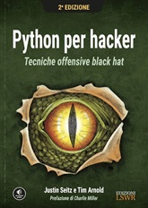

# Python for Hacker - Book
**Python for Hacker** is a book written by J. Seitz that shows how to code in Python for Ethical Hacking.

### Table of Contents
- [Chapter 1. Configure Python](#chapter-1-configure-python)
- [Chapter 2. Basic Networking](#chapter-2-basic-networking)

 

### Chapter 1. Configure Python

First chapter writes about general Python and Kali Linux settings and how to install them.

### Chapter 2. Basic Networking

This chapter shows how to create some clients and server with Python.
 
It shows different coding with explanations.

 

[Files/Chapter1](files/chapter1)