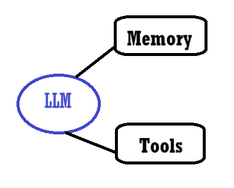

# Microsoft Developers Course on AI Agents

An introductory course on AI Agents, what those are and how to create one.
 
<a href="https://www.youtube.com/playlist?list=PLlrxD0HtieHgKcRjd5-8DT9TbwdlDO-OC">Youtube Link</a>
 
<a href="https://github.com/microsoft/ai-agents-for-beginners/tree/main">Github Repository</a>

## List of Content

- [1. Introduction to Deep Learning](#1-introduction-to-deep-learning)

## 1. What are AI Agents?

AI Agents mix a LLM, memory and tools to create a connection with the user in order how to deal and solve user tasks.
 
This first lesson shows the AI Agent parts and an overview of the code (that you can find on the above-mentioned Github repo).

- LLM: Large Language Model that can par our "reasoning", meaning it's able to identify a task and create a plan and actions to solve it.
- Memory: Collections of interactions between user and ai or data to improve Agent abilities.
- Tools: Functions or API calls that we use to send information to our Agent.

