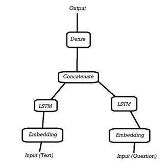
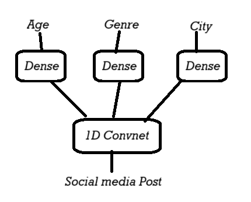

# DeepLearningBook
**Deep Learning with Python** is a great book, written by F. Chollet the founder of Keras. It starts with theory and explanations and it will show code and practice in order to build your own Deep Learning model.


### Table of Contents
- [Chapter 1. What is Deep Learning](#chapter-1-what-is-deep-learning)
- [Chapter 2. Before we Start: Basic Math for Neural Networks](#chapter-2-before-we-start-basic-math-for-neural-networks)
- [Chapter 3. Introduction to Neural Networks](#chapter-3-introduction-to-neural-networks)
- [Chapter 4. Machine Learning Fondamentals](#chapter-4-machine-learning-fondamentals)
- [Chapter 5. Deep Learning for computer vision](#chapter-5-deep-learning-for-computer-vision)
- [Chapter 6. Deep Learning for text and sequences](#chapter-6-deep-learning-for-text-and-sequences)
- [Chapter 7. Best practices for advanced Deep Learning](#chapter-7-best-practices-for-advanced-deep-learning)
- [Chapter 8. Generative Deep Learning](#chapter-8-generative-deep-learning)
- [Chapter 9. Conclusions](#chapter-9-conclusions)


## Step-By-Step Learning

### Chapter 1. What is Deep Learning
In this chapter we will study the theory behind Deep Learning. What is it, when it was born, and the main techniques used.

This is a simple schema on how the deep learning mechanism works:


### Chapter 2. Before we Start: Basic Math for Neural Networks
In this chapter we will study some basic math to better understand Neural Networks.
The book tries to explain the concepts using Python Numpy instead of pure Math.

<br>
The chapter starts with a very simple Neural Network code to begin with:

[Files/mnist.py](files/mnist.py)

Then the book explains the different tensor's types using Numpy:

Each code will start with: 
```bash
import numpy as np
```
And ends with this command to check the Dimension of the Numpy Array: 
```bash
print(x.dim)
```

<li>Scalars (tensors 0D):</li>

```bash
x = np.array(12)
```
(DIM = 0)

<li>Vectors (tensors 1D):</li>

```bash
x = np.array([12,3,6,14])
```
(DIM = 1)

<li>Matrix (tensors 2D):</li>

```bash
x = np.array([5,78,2,34,0],
            [6,79,3,35,1],
            [7,80,4,36,2])
```
(DIM = 2)

<li>Tensors 3D or more:</li>

```bash
x = np.array([[[5,78,2,34,0],
            [6,79,3,35,1],
            [7,80,4,36,2]],
            [[5,78,2,34,0],
            [6,79,3,35,1],
            [7,80,4,36,2]]])
```
(DIM = 3)


#### - Tensors are defined by 3 main attributes:
<li>Numer of Axis (rank)</li>
<li>Shape</li>
<li>Type of data (dtype)</li>

<br>
The book continues with other examples and methods to work with Tensors and more advanced Math concepts.


<br>

### Chapter 3. Introduction to Neural Networks

This chapter starts to explain how to use Keras, how to setup an environment and there are a few examples of different Deep Learning codes for classification and regression.

Files created:

- [Files/imdb.py](files/imdb.py) = Predict Internet Movie Recensions (Classification)
- [Files/reuters.py](files/reuters.py) = Predict '86 Agency Work-Sectors (Classification)
- [Files/bostonhousing.py](files/bostonhousing.py) - Predict Boston '70 House Prices (Regression)

<br>
Now we have seen some Deep Learning models for classification and regression using Keras!


<br>

### Chapter 4. Machine Learning Fondamentals

In this chapter we learned the 4 different types of Machine Learning:
<li>Supervised Learning</li>
<li>Unsupervised Learning</li>
<li>Auto-Supervised Learning</li>
<li>Reinforced Learning</li>

<br>

We have seen some protocols for model evaluation:
<li>Hold-Out</li>
<li>K-fold</li>
<li>K-fold with shuffling</li>

<br>

Then we have seen some data pre-elaboration:
<li>Vectorization</li>
<li>Values Normalization</li>
<li>Missing data handling</li>

<br>

The book explained some methods to avoid Overfitting or Underfitting:
<li>Reduce network dimension</li>
<li>Weights Regularization</li>
<li>Use Dropout</li>

<br>

Finally, we learned a common path to follow when dealing with Machine Learning:
<li>Define problem and create/find dataset</li>
<li>Select the evaluation param (example: accuracy or roc auc curve..)</li>
<li>Find an evaluation protocol</li>
<li>Prepare data</li>
<li>Create a model that performs better than a random one</li>
<li>Create a model that does Overfit</li>
<li>Regularize the model and optimize hyperparams</li>
<li>Test your model</li>


<br>

### Chapter 5. Deep Learning for computer vision

This chapter starts introducing ConvNet, an useful neural network for computer vision.
<br>
We can see some examples on how to use convnet for the mnist image dataset, explaining how to Convolution works.
<br>
We learn about Max-Pooling and how it's used with convnet.
<br>
We can create a code using Kaggle "dogs vs cats" dataset, in order to create a convnet to predict images of dogs and cats.

**Standard approach**
<li>Download dataset</li>
<li>Create folders for train, test and validation sets</li>
<li>Create neural network using Conv2d and MaxPooling</li>
<li>Add a Flatten and some Dense layers</li>
<li>Pre-elaborate data (the images) using ImageDataGenerator from Keras</li>

```bash
from keras.preprocessing.image import ImageDataGenerator
```

This class is useful for elaborate images and you can use it for data-augmentation as well!

<li>Save the model and plot the results</li>
We got around 70% precision on our validation sets!

<br>

**Data Augmentation**
<li>Add some data-augmentation using ImageDataGenerator</li>
<li>Create a new neural network using these augmented data</li>
<li>Save model and show results</li>
This time we haven't received any Overfitting and the model reached a 82% precision!

<br>

**Use a pre-trained convnet without data-augmentation**
<li>Use the VGG16 pre-trained model from Keras</li>

```bash
from keras.applications import VGG16
```

<li>Define our neural network that will receive the VGG16 pre-trained model</li>
<li>Freeze the VGG16 layers so that the pre-trained model won't update its weights and just use them for our new model</li>
<li>Plot results</li>
Now the Overfitting is back but we've got around 90% precision!

<br>

**Use a pre-trained convnet with data-augmentation**
<li>Use VGG16 with our augmented-data</li>
<li>Plot results</li>
Now the Overfit is much lower and the accuracy went to 96%!

<br>

**Fine Tuning**

Those are the steps required for Fine-Tune a pre-trained neural network:
<li>Add your personalized network above a pre-trained network</li>
<li>Freeze the layers of the base network (the pre-trained one)</li>
<li>Train the new network</li>
<li>Unfreeze the last layers of the pre-trained network</li>
<li>Train the whole network (both the unfreezed layers and your new network)</li>

We proceeded on Fine-Tuning a pre-trained network
<li>Unfreeze last layers</li>
<li>Retrain the network and show results</li>
Now our accuracy increased to 97%!

<br>

**Visualize middle activations**

The book shows how to visualize the middle activations of a convnet, showing the images (or the part of the images) that the net is processing, step-by-step. 
<br>
Then it shows how to see filters of a convnet and show the parts of the image that best activates the layers.

<br>
For a general guide you can see this code:

- [Files/convnet.py](files/convnet.py) = Some code explained in Chapter 5, using convnet


<br>

### Chapter 6. Deep Learning for text and sequences

<br>

**Tokenizer and Embedding**

This chapter explains how to create neural networks for text and sequences. It shows some one-hot-encoding methods, with Tokenizer:

```bash
from keras.preprocessing.text import Tokenizer
```

It shows the word-embedding method, with the layer Embedding:

```bash
from keras.layers import Embedding
```

It explains how to use pre-trained word-embedding layers, for example the GloVe.

<br>

**Recurrent Neural Network (RNN)**

Recurrent Neural Network are used for sequences and text and it shows how to use SimpleRNN, mixing Embedding and SimpleRNN.

```bash
from keras.layers import SimpleRNN
```

<br>

**Other layers for text and sequences: LSTM - GRU**

It shows how to create a neural network using LSTM or GRU.

```bash
from keras.layers import LSTM
```

<br>

**Temperature prediction**

An example on how to create a model for temperature predictions, guiding step-by-step:

<li>Download data and Prepare it</li>
<li>Create some simple "good sense" approach to see if your future model will outperform this. You can do so even without Machine-Learning, for example calculating Mean Absolute Error of your data and see if you can have better results than this value with your model.</li>
<li>Create a simple neural network, the most basic, using Dense layers and see how it performs.</li>
<li>Use Recurrent layer(s) to see if those achieve a better performance.</li>
<li>Add dropout to defeat overfit</li>
<li>Add more layers to increase network strength.</li>
<li>Check results and modify what lacks.</li>

<br>

**Bidirectional RNN**

It shows how to create a bidirectional RNN, using the Bidirectional layer:

```bash
from keras.layers import Bidirectional
```

<br>

**Conv net 1D**

It explain the existence of 1D Convolutional Networks (previously we have used Conv2D) and it's MaxPooling1D. 
<br>
It then mixes everything we learned in this chapter to create a neural network.

<br>
We have seen other layers that we can use in our Keras models!


<br>

### Chapter 7. Best practices for advanced Deep Learning 

<br>

**Functional Keras API**

In this chapter we see the functional Keras API to create tensors that receive tensors and return tensors. Example below: 

```bash
from keras import Input, layers
from keras.models import Model

input_tensor = Input(shape(64, ))
x = layers.Dense(32, activation='relu')(input_tensor)
x = layers.Dense(32, activation='relu')(x)
output_tensor = layers.Dense(10, activation='softmax')(x)

model = Model(input_tensor, output_tensor)
```

**Multi-input models**

With this new configuration you can configure multi-input models, like this example:




**Multi-output models**

Similarly, you can create a model with multi-output




**Graphs**

With these you can create graphs: advanced connections between layers.
<br>
The book shows some models that uses graphs architetture:
<li>Inception Module</li>
<li>Residual Connections</li>

<br>

**Keras Callback and Tensorflow TensorBoard**

You can use Keras callbacks methods to customize and gain insight of what's happening in your neural network.

**ModelCheckpoint and EarlyStopping**

<li>EarlyStopping: stop the training when a certain condition or loss is met</li>
<li>ModelCheckpoint: save the model when a certain condition is met</li>

```bash
import keras

callbacks_list = [
    keras.callbacks.EarlyStopping(monitor='acc', patience=1),
    keras.callbacks.ModelCheckpoint(filepath='my_model.h5', monitor='val_loss', save_best_only=True)
]

model.compile(optimizer='rmsprop', loss='binary_crossentropy', metrics=['acc'])
model.fit(x, y, epochs=10, callbacks=callbacks_list, validation_data=(x_val, y_val))
```

You can create your own Callback method.
<br>
These are some keras.callbacks.Callback methods already present in Keras:

<li>on_epoch_begin</li>
<li>on_epoch_end</li>
<li>on_batch_begin</li>
<li>on_batch_end</li>
<li>on_train_begin</li>
<li>on_train_end</li>


<br>

**TensorBoard**

TensorBoard is a powerful website that you can use, creating a TensorBoard Callback method. In this website you can monitor anything that's happening in your neural network.

```bash
import keras

callbacks_list = [
    keras.callbacks.TensorBoard(log_dir='my_log_dir', histogram_freq=1, embeddings_freq=1)
]

model.fit(x, y, epochs=20, batch_size=128, validation_split=0.2, callbacks=callbacks_list)
```

Then you can go to https://localhost:6006 to see your neural network!


**Keras plot_model**

Another powerful tool is in keras.utils, the plot_model from Keras. With this you can create a png image of every layer of your neural network!

```bash
from keras.utils import plot_model

plot_model(model, show_shapes=True, to_file='model.png')
```

<br>

**Get max efficiency of your models**

The book shows some advanced techniques to improve your models, such as:
<li>Batch normalizzation</li>
<li>Depth separable convolution</li>
<li>Hyperparameters Fine-Tuning</li>
<li>Model assembly</li>

<br>
This chapter shows some cool and advanced techniques to improve the quality of your neural networks!


<br>

### Chapter 8. Generative Deep Learning

The book shows how to generate new content with Generative Deep Learning.

<br>

**Text generation with LSTM**

In the example we see how to create a LSTM model that generates new text, starting from Nietzsche text from Wikipedia

- [Files/LSTM_gen_text.py](files/LSTM_gen_text.py) = Simple LSTM model that generates text

<br>
The books then shows some other models for Generative Deep Learning, such as DeepDream and how to implement it with Keras.
<br>
It shows some techniques for style transfer, in order to apply the "style" of an image to another image, and how to do it with Keras.

<br>

**Variational Autoencoder (VAE) and Generative Adversarial Network (GAN)**

It explains what VAE and GAN are, how they works, their differences and how to implement them with Keras.
<br>
Talking about GAN, it shows how to implement the Generator and the Discriminator: two different neural networks that must be used in a GAN model in order to create a DCGAN network.

<br>
This chapter shows how to generate new text from other text and explains what VAE and GAN are and how to use them with Keras!


<br>

### Chapter 9. Conclusions

This final chapter reviews the concepts studied in the book.

<li>What makes Deep Learning so special?</li>
<li>How to approach Deep Learning</li>
<li>Key technologies</li>
<li>Common schema to use when working with Deep Learning (see Ch. 4)</li>

<br>
Then it shows the main models to use:

<br>

**Densely Connected Networks (DENSE)**

A densely connected network is a pile of Dense layers to elaborate vector data. 
<br>
This network doesn't have any specific structure in its input architecture: every layers if fully connected with the others.
<br>

CLASSIFICATION - BINARY

```bash
from keras import models
from keras import layers

model = models.Sequential()
model.add(layers.Dense(32, activation='relu', input_shape=(num_input_features, )))
model.add(layers.Dense(32, activation='relu'))
model.add(layers.Dense(1, activation='sigmoid'))

model.compile(optimizer='rmsprop', loss='binary_crossentropy')
```

<br>

CLASSIFICATION - SINGLE-LABEL

```bash
from keras import models
from keras import layers

model = models.Sequential()
model.add(layers.Dense(32, activation='relu', input_shape=(num_input_features, )))
model.add(layers.Dense(32, activation='relu'))
model.add(layers.Dense(num_classes, activation='softmax'))

model.compile(optimizer='rmsprop', loss='categorical_crossentropy')
# If int you can use loss='sparse_categorical_crossentropy' instead
```

<br>

CLASSIFICATION - MULTI-LABEL

```bash
from keras import models
from keras import layers

model = models.Sequential()
model.add(layers.Dense(32, activation='relu', input_shape=(num_input_features, )))
model.add(layers.Dense(32, activation='relu'))
model.add(layers.Dense(num_classes, activation='sigmoid'))

model.compile(optimizer='rmsprop', loss='binary_crossentropy')
```

<br>

REGRESSION - CONTINUOUS VALUES

```bash
from keras import models
from keras import layers

model = models.Sequential()
model.add(layers.Dense(32, activation='relu', input_shape=(num_input_features, )))
model.add(layers.Dense(32, activation='relu'))
model.add(layers.Dense(num_classes))

model.compile(optimizer='rmsprop', loss='mse')
# You can use MSE or MAE or other metrics
```

<br>

**Convolution Layers (CONVNET)**

Convolutions layers search local patterns from spacial point-of-view, applying the same transformation to different spatial positions (patch).
<br>
This network are very effective in data elaboration and modularity. 
<br>
<li>Conv1D: useful for sequences (like text)</li>
<li>Conv2D: useful for images</li>
<li>Conv3D: useful for volumes (like videos)</li>
<br>
These networks must use Pooling layer(s) to sub-sample the data (and reduce their size) and usually they end with Dense layer(s) and before them a Flatten() layer of a GlobalAveragePooling() layer.

<br>
However, these networks are replaced by Depth Separable Convolution layers (SeparableConv2D) since this is faster and more efficient.


CONV - IMAGE CLASSIFICATION

```bash
from keras import models
from keras import layers

model = models.Sequential()
model.add(layers.SeparableConv2D(32, 3, activation='relu', input_shape=(height, width, channels)))
model.add(layers.SeparableConv2D(64, 3, activation='relu'))
model.add(layers.MaxPooling2D(2))
model.add(layers.SeparableConv2D(64, 3, activation='relu'))
model.add(layers.SeparableConv2D(128, 3, activation='relu'))
model.add(layers.GlobalAveragePooling2D())  
model.add(layers.Dense(32, activation='relu'))
model.add(layers.Dense(num_classes, activation='softmax'))

model.compile(optimizer='rmsprop', loss='categorical_crossentropy')

# You may use Flatten() instead of GlobalAveragePooling2D()
```

<br>

**Recurrent Neural Network (RNN)**

This network elaborates a single timestep input at time while keeping a state (a vector or list of vectors, a point in the states-space)
<br>
This network performs better than Conv1D for time-series where the recent-past is more important than long-past.
<br>
There are three possible RNN layers in Keras:
<li>SimpleRNN: the simplest RNN</Li>
<li>LSTM: the strongest RNN, but slower</li>
<li>GRU: a simpler LSTM and less expensive</li>

<br>

BINARY CLASSIFICATION FOR VECTOR SEQUENCES - LSTM

```bash
from keras import models
from keras import layers

model = models.Sequential()
model.add(layers.LSTM(32, return_sequences=True, input_shape=(num_timesteps, num_features)))
model.add(layers.LSTM(32, return_sequences=True))
model.add(layers.LSTM(32))
model.add(layers.Dense(num_classes, activation='sigmoid'))

model.compile(optimizer='rmsprop', loss='binary_crossentropy')
```


<br>

The book procedes with other explanations:
<li>Space of Possibilities for Deep Learning</li>
<li>Deep Learning limits</li>
<li>Deep Learning risks</li>
<li>Local Generalization VS Extreme Generalization</li>

Them, the author explains his point of view for the future of Deep Learning.
<br>
Finally, some last methods to staying up-to-date and improve in Deep Learning:
<li>Practice on Kaggle</li>
<li>Watch last achievements in arXiv or arXiv Sanity Preserver websites</li>
<li>Explore Keras</li>

<br>
This final chapter concentrates everything we learned so far, with some words from the author (founder of Keras)!