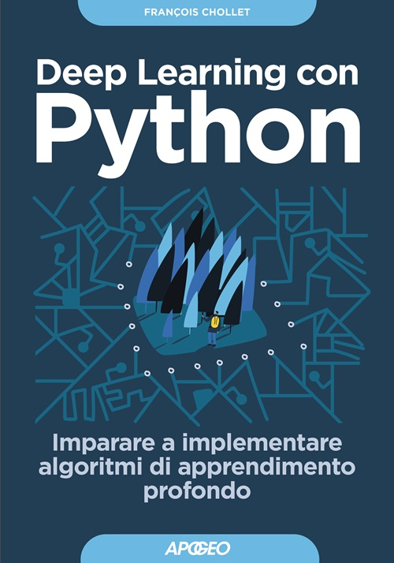
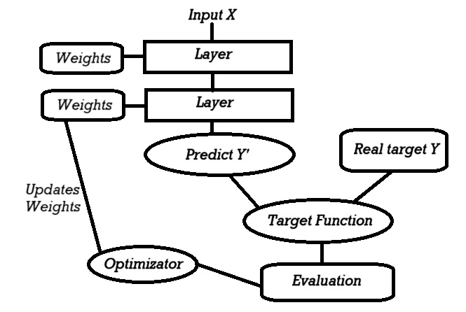

# DeepLearningBook
**Deep Learning with Python** is a great book, written by F. Chollet the co-founder of Keras. It starts with theory and explanations and it will show code and practice in order to build your own Deep Learning model.

### Table of Contents
- [Chapter 1. What is Deep Learning](#chapter-1-what-is-deep-learning)

## Step-By-Step Learning

### Chapter 1. What is Deep Learning
In this chapter we will study the theory behind Deep Learning. What is it, when it was born, and the main techniques used.

This is a simple schema on how the deep learning mechanism works:

