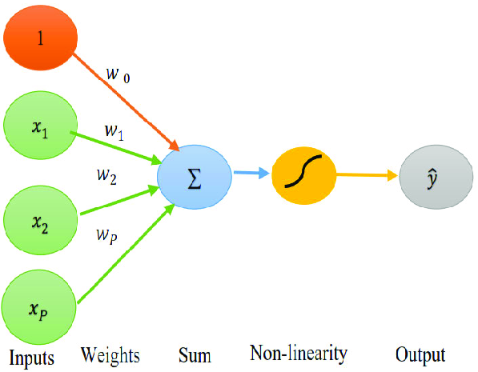

# MIT 6.S191 - DEEP LEARNING

MIT bootcamp on Deep Learning, held by Alexander and Ava Amini for MIT. 
 
This course will teach from basics to advanced concepts of Deep Learning and its applications.
 
<a href="https://www.youtube.com/playlist?list=PLtBw6njQRU-rwp5__7C0oIVt26ZgjG9NI">Youtube Link</a>
 
<a href="https://introtodeeplearning.com/">Official website</a>

## List of courses

- [1. Introduction to Deep Learning](#1-introduction-to-deep-learning)

 

## 1. Introduction to Deep Learning

**Introduction**

The course starts by showing the differences and the rapid growth of Deep Learning capabilities.
 
For example, in 2015 face-generating models were able to create an opaque black and white image and in 2020 they were able to create a short videoclip of Obama talking about the MIT course. However, that short videoclip costed 50+ hours of videos and 15k+ hardware, meaning that:

**Deep Learning is evolving fast, but the hardware cost is also as important**

Then, Alexander showed the present days: 2025. While speaking, he had a script that was registering his voice and it used that to create a Deep Learning model able to speak similarly to him. 

 

**What is Artificial Intelligence?**

<li>AI is any technique that makes the computer do the same thing done by a human.</li>
<li>Machine Learning is the ability (of the computer) to learn without being specifically programmed.</li>
<li>Deep Learning is extracting patterns from data using Neural Networks</li>

 

**Features**
are the individual measurable properties or characteristics of the input data that are used by the model to make predictions.
 
The neural network works in this way:

<li>1. Input layer</li>
The model receives raw data: pixels (images), words/tokens (text), numerical values, etc.

<li>2. Hidden layers (feature extraction happens here)</li>
Each hidden layer in a neural network transforms the input using weights and biases (which are learned through training).
Early layers learn basic features (e.g., edges in images, simple patterns in text).
Deeper layers combine simpler features into more complex and abstract features (e.g., object shapes, grammar structures, faces).

 
Example:
 
In an image classifier:
<li>Layer 1: learns edges.</li>
<li>Layer 2: combines edges into shapes.</li>
<li>Layer 3+: learns objects like eyes, wheels, or faces.</li>

 

**What made Deep Learning grow so fast in the last years?**
 
<li>Big Data: massive data available to be used, now it's much more easy to gather big loads of data</li>
<li>Hardware: current hardware is much more powerful than years ago, enabling faster and better neural networks</li>
<li>Open Source Software: best software are available to use, the community is bigger and many ideas can be created together</li>

 

**Perceptron, forward propagation**

 

**Common activation functions**

The purpose of activation functions is to introduce non-linearities into the network.
 
Real world data isn't linear, that's why.
 
If we have to split points across the space, with linearity we would just draw a straight line hitting both points, while with non-linear we can circle and get the correct points.
 
This makes Deep Learning a formidable asset in finding patterns.