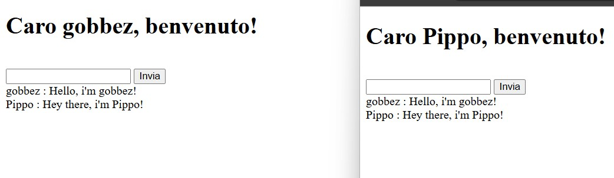

# DjangoBook
Python Django excercises of the book "Sviluppare applicazioni con Django (M. Beri)"


### Details
This repository is used to study from the above mentioned book. <br>
I'll add the steps explained with a description. 
The book will start from the very basics to an advanced level.

Feel free to clone this repo!

### Table of Contents
- [Chapter 1. Install Django + "Hello World"](#chapter-1-install-django--hello-world)
- [Chapter 2. Database, ORM, Model](#chapter-2-database-orm-model)
- [Chapter 3. Admin](#chapter-3-admin)
- [Chapter 4. Url](#chapter-4-url)
- [Chapter 5. Templates](#chapter-5-templates)
- [Chapter 6. Forms](#chapter-6-forms)
- [Chapter 7. Query](#chapter-7-query)
- [Chapter 8. Security and Permissions](#chapter-8-security-and-permissions)
- [Chapter 9. Internationalization](#chapter-9-internationalization)
- [Chapter 10. Signals](#chapter-10-signals)
- [Chapter 11. Async Vs Sync](#chapter-11-async-vs-sync)
- [Chapter 12 - How to generate PDF files](#chapter-12-how-to-generate-pdf-files)
- [Chapter 13 - Ajax](#chapter-13-ajax)
- [Chapter 14. Real-time Communication](#chapter-14-real-time-communication)
- [Chapter 15. Testing and Debugging](#chapter-15-testing-and-debugging)
- [Chapter 16. Personalized Tags and Filters](#chapter-16-personalized-tags-and-filters)
- [Chapter 17. Cookies and sessions](#chapter-17-cookies-and-sessions)
- [Chapter 18. Pagination](#chapter-18-pagination)
- [Chapter 19. Social Authentication](#chapter-19-social-authentication)
- [Chapter 20. Web Security](#chapter-20-web-security)
- [Chapter 21. HTMX](#chapter-21-htmx)


## Step-By-Step Learning

### Chapter 1. Install Django + "Hello World"
<li>First thing to do is install Django (in a virtual environment):</li>

```bash
pip install django
```
<li>Create the new Django project with this command:</li>

```bash
django-admin startproject hello
```

<li>Set the SECRET_KEY (in hello/settings.py) in another file and add it in .gitignore</li>
<li>Create a new View in hello/views.py with a "Hello World" message.</li>
<li>Create the new route calling the View in hello/urls.py.</li>
<li>Run the server to see the new route with the "Hello World" message.</li>

```bash
cd hello
python manage.py runserver
(go to http://127.0.0.1:8000/hello/)
```

<br>

### Chapter 2. Database, ORM, Model
<li>Create a new application with the command:</li>

```bash
django-admin startapp libreria
```

<li>Add the new application in INSTALLED_APPS in hello/settings.py</li>
<li>Create a new model: libreria/models.py with 3 new table (Autore, Genere, Libro)</li>
<li>Create migrations for the new tables</li>

```bash
python manage.py makemigrations
python manage.py migrate
```
<br>

### Chapter 3. Admin
<li>Modify file libreria/admin.py like this:</li>

```bash
from django.contrib import admin

# Register your models here.
from . import models

admin.site.register(models.Genere)
admin.site.register(models.Autore)
admin.site.register(models.Libro)
```
<li>Create a superuser from command and following instructions (to set username, email, password)</li>

```bash
python manage.py createsuperuser
```
<li>Start server and go to http://127.0.0.1:8000/admin/</li>
<li>(optional) In each table (libreria/models.py) add a class Meta to make the visualizzation of the table names correct:</li>

```bash
class Meta:
    verbose_name_plural = "Autori" (# same thing for "Generi" and "Libri")
```

<li>In each table (libreria/models.py) ad a __str__(self): function that returns correctly the column names</li>

```bash
class __str__(self):
    return f"{self.nome} {self.cognome}"  (# same thing for other tables)
```

<li>Create a new libro, new autore and new genere via admin panel on the browser</li>
Now you are free to add/modify/delete as many rows in the tables as you want!

<br><br>

### Chapter 4. Url

<li>Add a new route 'libri', in the hello/urls.py, importing the libreria/views.py and its class (libri)</li>
<li>Modify libreria/views.py to create the class libri: this class will show the list of books (for now without using Templates)</li>
<li>Start the server and go to http://127.0.0.1:8000/libri/ to see all the books you have added</li>
<li>Create a new route in hello/urls.py to use a re_path to check what book the user is searching:</li>

```bash
from django.contrib import admin
from django.urls import path, re_path

from hello import views
from libreria import views as views_libreria

urlpatterns = [
    path('admin/', admin.site.urls),
    path('hello/', views.hello, name='hello'),
    path('libri/', views_libreria.libri, name="libri"),
    re_path('^libri/(\d+)/$', views_libreria.libro, name="libro"),
]
```

<li>Create corresponding functions in libreria/views.py (for now without using Templates): </li>

```bash
from django.shortcuts import render
from django.http import HttpResponse
from .models import *

def libri(request):
    elenco = ""
    for libro in Libro.objects.all().order_by('titolo'):
        elenco += (f'"{libro.titolo}" di {libro.autore}, {libro.genere}<br>')
    return HttpResponse(elenco)

def libro(request, pk):
    try:
        libro = Libro.objects.get(pk=pk)
        return HttpResponse(f'"{libro.titolo}" di {libro.autore}, {libro.genere}<br>')
    except:
        return HttpResponse(f"Codice {pk} inesistente")
```

<li>Modify libreria/models.py to add a DateField in the table (class) Libro</li>
<li>Execute makemigrations and migrate on command line</li>
<li>Modify libreria/admin.py to create a better visualization of the books:</li>

```bash
from django.contrib import admin

# Register your models here.
from . import models

class LibroAdmin(admin.ModelAdmin):
    list_display = ['titolo', 'autore', 'genere', 'data_acquisto']

admin.site.register(models.Genere)
admin.site.register(models.Autore)
admin.site.register(models.Libro, LibroAdmin)
```

<li>Start server and go to http://127.0.0.1:8000/admin/libreria/libro/ to see the new html table of your books</li>
<li>In hello/urls.py to create a new route to search for data too:</li>

```bash
re_path(r'^libri/acquistati/(?P<anno>\d{4})/(?P<mese>\d{1,2})/$', views_libreria.libri_per_data_acquisto),
```
<li>In libreria/views.py add the new function for that route:</li>

```bash
def libri_per_data_acquisto(request, mese, anno):
    libri = Libro.objects.filter(data_acquisto__year=int(anno), data_acquisto__month=int(mese)).order_by('titolo')
    elenco = ""
    for libro in libri:
        elenco += (f'"{libro.titolo}" acquistato il: {libro.data_acquisto}<br>')
    if elenco == "":
        elenco = "Nessun libro"
    return HttpResponse(elenco)
```

<li>Start server, add a date in a book in the admin panel, then try to filter for data (example below)</li>

```bash
http://127.0.0.1:8000/libri/acquistati/2025/3/
```

Now you can filter for data as well!

<br>

### Chapter 5. Templates

<li>Create a new directory as libreria/templates</li>
<li>Create html (Template) file libreria/templates/libri.html that uses a for loop to show books</li>
<li>Change function libri in libreria/views.py:</li>

```bash
def libri(request):
    context = {'libri': Libro.objects.all().order_by('titolo')}
    return render(request, "libri.html", context)
```
<li>Update file libreria/templates/libri.html to add links of the books</li>
<li>Add the new routes in hello/urls.py: </li>

```bash
    re_path('^libri/autore/(?P<pk>\d+)/$', views_libreria.libri_autore, name='libri_autore'),
    re_path('^libri/genere/(?P<pk>\d+)/$', views_libreria.libri_genere, name='libri_genere'),
```

<li>Add the two new functions in libreria/views.py:</li>

```bash
def libri_genere(request, pk):
    genere = get_object_or_404(Genere, pk=pk)
    context = {'libri': Libro.objects.filter(genere=genere).order_by('titolo'), 'genere': genere}
    return render(request, "libri.html", context)

def libri_autore(request, pk):
    autore = get_object_or_404(Autore, pk=pk)
    context = {'libri': Libro.objects.filter(autore=autore).order_by('titolo'), 'autore': autore}
    return render(request, "libri.html", context)
```
<li>Update file libreria/templates/libri.html</li>
<li>Change hello/urls.py so that it uses include to call the libreria/urls.py: </li>

```bash
from django.contrib import admin
from django.urls import path, re_path, include

from hello import views
from libreria import views as views_libreria

urlpatterns = [
    path('admin/', admin.site.urls),
    path('hello/', views.hello, name='hello'),
    path('libri/', include('libreria.urls')),
]
```

<li>Create libreria/urls.py: </li>

```bash
from django.urls import path, re_path
from . import views

urlpatterns = [
    path('', views.libri, name="libri"),
    re_path('^(\d+)/$', views.libro, name="libro"),
    re_path(r'^acquistati/(?P<anno>\d{4})/(?P<mese>\d{1,2})/$', views.libri_per_data_acquisto),
    re_path('^autore/(?P<pk>\d+)/$', views.libri_autore, name='libri_autore'),
    re_path('^genere/(?P<pk>\d+)/$', views.libri_genere, name='libri_genere'),
]
```
<li>Create a new folder templates in the root of the project</li>
<li>Create the base html file templates/base.html</li>
<li>Add the following in hello.settings.py in TEMPLATES: </li>

```bash
    'DIRS': [BASE_DIR / "templates"],
```

<li>Add the following in libreria/templates/libri.html to extend the base.html file: </li>

```bash

La mia libreria

```

Now we have created a templates file to show our library and books, with links!

<br>

### Chapter 6. Forms

<li>Add a route for wikipedia search on libreria/urls.py:</li>

```bash
re_path('^ricerca/$', views_wiki.ricerca, name='libri_ricerca'),
```

<li>Create a new file libreria/templates/libreria/wikisearch.html</li>
<li>Create a new file libreria/views_wiki.py</li>
<li>Add a function in the WikisearchForm class on libreria/views_wiki.py</li>
<li>Modify form.as_p to put in a table, in libreria/templates/libreria/wikisearch.html</li>

```bash
<table border="1">
    {{ form.as_table }}
</table>
```

We have seen how to create some simple forms in a new html page!


<br>

### Chapter 7. Query

<li>Exercises with Django shell to create, filter, update, delete different rows on the tables (no new code)</li>


<br>

### Chapter 8. Security and Permissions

<li>Go to admin panel and create and advanced user that can edit Autori table</li>
<li>Now create a Group with the same grants</li>
<li>Apply this new Group to the new user</li>

<li>Differentiate pages based on user's role by modifying libreria/libri.html for loop:</li>

```bash

    <a href="">[E]</a>

```

Now users with grants can edit in the http://127.0.0.1:8000/libri/ !

<li>Add login_required to see pages, in libreria/views_wiki.py: </li>

```bash
from django.contrib.auth.decorators import login_required

@login_required
def ricerca(request):
```

Now users that aren't logged in cannot search our books!


<br>

### Chapter 9. Internationalization

<li>Change/Add some params in hello/settings.py to activate multi-language: </li>

```bash
LANGUAGES = [
    ('it', 'Italiano'),
    ('en', 'English'),
]

MIDDLEWARE_CLASSES = [
    'django.middleware.locale.LocaleMiddleware',
]

TEMPLATES = [
    {
        ...
        'OPTIONS': {
            'context_processors': [
                ...
                'django.template.context_processors.i18n',
            ],
        },
    },
]
```

<li>Modify hello/base.html to add the form to change language</li>
<li>Add a new route in hello/urls.py: </li>

```bash
path("i18n/", include("django.conf.urls.i18n")),
```

<li>Modify libreria/view_wiki.py to set the strings to translate: </li>

```bash
from django.utils.translation import gettext_lazy as _

    ...
    raise forms.ValidationError(_("Massimo 50 risultati in inglese"))
```

<li>Modify libreria/wiki_search.html to elaborate the string to translate</li>
<li>Create new folder libreria/locale</li>
<li>Execute the following command: </li>

```bash
python manage.py makemessages -l en --no-wrap
```
PLEASE NOTE: TO DO THE ABOVE YOU MUST HAVE GETTEXT ON YOUR PC AND YOU MUST ADD ITS BIN FOLDER TO THE ENVIRONMENT VARIABLE!!

<li>Modify file libreria/locale/en/LC_MESSAGES/django.po: </li>

```bash
msgid "Ricerca Wikipedia"
msgstr "Wikipedia Search"

#: .\libreria\templates\libreria\wikisearch.html:11
msgid "Cerca"
msgstr "Search"

#: .\libreria\templates\libreria\wikisearch.html:14
#, python-format
msgid "%(numero_risultati)s risultati"
msgstr "%(numero_risultati)s results"

#: .\libreria\views_wiki.py:21
msgid "Massimo 50 risultati in inglese"
msgstr "Max 50 english results"
```

<li>Execute the following command: </li>

```bash
python manage.py compilemessages
```

Now the code should allow you to translate in different languages!


<br>

### Chapter 10. Signals

<li>Create a new file in libreria/helpers.py: </li>

```bash
import sys

def log_colorato(messaggio):
    GIALLO_SU_NERO = "\033[43m\033[30m"
    RESET = "\033[0m"

    sys.stdout.write(f"{GIALLO_SU_NERO}{messaggio}{RESET}")
    sys.stdout.flush()
```

<li>Create a new file in libreria/signals.py: </li>

```bash
from django.db.models.signals import post_save
from django.dispatch import receiver

from .helpers import log_colorato
from .models import Autore

@receiver(post_save, sender=Autore)
def libro_post_save(sender, instance, created, **kwargs):
    if created:
        log_colorato(f"Un nuovo {sender.__name__} è stato creato: {instance}")
    else:
        log_colorato(f"Un {sender.__name__} esistente è stato aggiornato: {instance}")
```

<li>Modify libreria/apps.py to make the signals work: </li>

```bash
from django.apps import AppConfig

class LibreriaConfig(AppConfig):
    default_auto_field = 'django.db.models.BigAutoField'
    name = 'libreria'

    def ready(self):
        import libreria.signals
```

<li>Run server and create a new Autor via admin panel. You will see some colored prints in the shell!</li>

<li>Modify libreria/signals.py to create some functions that shows users logged when someone logs in, using: </li>

```bash
from django.contrib.auth.signals import user_logged_in, user_logged_out
from django.db.models.signals import Signal
```

Now we can create some personalized functions using Signals!


<br>

### Chapter 11. Async Vs Sync

<li>Install Daphne, a module to use server ASGI: </li>

```bash
pip install daphne
```

<li>Modify file hello/settings.py to include daphne and set ASGI_APPLICATION instead of WSGI_APPLICATION: </li>

```bash
INSTALLED_APPS = [
    'daphne',
    ...
]

# WSGI_APPLICATION = 'hello.wsgi.application'
ASGI_APPLICATION = 'hello.asgi.application'
```

<li>Create a new application for async or sync: </li>

```bash
django-admin startapp async_sync
```

<li>Create file async_sync/urls.py: </li>

```bash
from django.urls import path

from . import views

urlpatterns = [
    path('sync/', views.view_sync, name='sync'),
    path('async/', views.view_async, name='async'),
]
```

<li>Modify file async_sync/view.py with the views for async and sync routes</li>
<li>Modify file hello/urls.py to include the new routes: </li>

```bash
path('async-sync/', include('async_sync.urls')),
```

<li>Run server and try the new routes, such as: http://127.0.0.1:8000/async-sync/sync/ and http://127.0.0.1:8000/async-sync/async/</li>

Now we can see the differences between a Sync and Async routes!


<br>

### Chapter 12. How to generate PDF files

<li>Install Weasyprint module: </li>

```bash
pip install weasyprint
```

<li>Add a function to generate pdf file in libreria/views.py: </li>

```bash
from weasyprint import HTML

def libri_pdf(request):
    html = HTML(string=libri(request).content)
    response = HttpResponse(content_type='application/pdf')
    response['Content-Disposition'] = ('attachment; filename="libri.pdf"')

    html.write_pdf(response)
    return response
```

<li>Create route in libreria/urls.py: </li>

```bash
re_path('pdf/', views.libri_pdf, name='libri_pdf'),
```

<li>Run server and create a pdf file with the url: http://127.0.0.1:8000/libri/pdf/ </li>

Now you can convert your html page in a pdf file!
PLEASE NOTE: IF YOU ARE USING WINDOWS YOU ALSO NEED TO INSTALL GTK (gtk3-runtime-*.exe)


<br>

### Chapter 13. Ajax

<li>Modify file templates/base.html to create the base to let our code use Ajax: </li>

```bash
<head>
    <title>Hello world!</title>
    
</head>
```

<li>Modify file libreria/views.py adding a function search and results to create Ajax search</li>
<li>Modify file libreria/urls.py to add the routes of our Ajax search: </li>

```bash
path('cerca/', views.cerca, name='libri_cerca'),
path('risultati/', views.risultati, name='cerca_risultati'),
```

<li>Create file libreria/templates/libreria/cerca.html to use Ajax with javascript in our code</li>
<li>Create file libreria/templates/libreria/risultati.html to show the results of our search</li>

Now it's possible to search for a book or author and Ajax will show us the results in real-time!!


<br>

### Chapter 14. Real-time Communication

<li>Install Django Channels to execute Asycn protocols: </li>

```bash
pip install channels
```

<li>Add channels in INSTALLED_APPS of hello/settings.py</li>
<li>Create a new application for our real-time web chat: </li>

```bash
python manage.py startapp webchat
```

<li>Create file webchat/urls.py: </li>

```bash
from django.urls import path
from django.contrib.auth.views import LoginView
from . import views

urlpatterns = [
    path("", views.webchat, name="webchat"),
    path("login/", LoginView.as_view(template_name="webchat/login.html"), name="login"),
]
```

<li>Update file hello/urls.py to include the new path</li>
<li>Modify file webchat/views.py: </li>

```bash
from django.shortcuts import render, redirect
from django.urls import reverse

def webchat(request, *arg, **kwargs):
    if not request.user.is_authenticated:
        return redirect(f"{reverse('login')}?next={request.path}")
    context = {}
    return render(request, "webchat/webchat.html", context)
```

<li>Create file webchat/consumers.py to program our webchat</li>
<li>Create file webchat/routing.py to pass the routes of our webchat</li>
<li>Modify file hello/settings.py</li>
<li>Modify file hello/asgi.py so that it can now work with http and websocket requests</li>
<li>Create file and folder webchat/templates/webchat/login.html to generate a simple login form</li>
<li>Create file webchat/templates/webchat/webchat.html to show our real-time webchat</li>

<br>



As you can see, now we have created a real-time multi-users WebChat!!!


<br>

### Chapter 15. Testing and Debugging

<li>Update libreria/tests.py to let Django do a test on our Autore table: </li>

```bash
from django.test import TestCase
from .models import Autore

class AutoreTest(TestCase):
    def test_(self):
        Autore.objects.create(nome="John", cognome="Cleese")
        self.assertEqual(len(Autore.objects.all()), 1)
        self.assertEqual(Autore.objects.get(cognome="Cleese").nome, 'John')
```

<li>Execute test:</li>

```bash
python manage.py test
```

<li>Install Selenium: </li>

```bash
pip install selenium
```

<li>Add our unit test on hello/settings.py: </li>

```bash
pip install selenium
```

<li>Update file webchat/tests.py to create an automatism that makes our webchat talk with itself</li>
<li>Execute our webchat test: </li>

```bash
python manage.py test webchat
```

<li>Install Django-debug-toolbar: </li>

```bash
pip install django-debug-toolbar
```

<li>Create Django Debug Toolbar adding it in INSTALLED_APPS, MIDDLEWARE and INTERNAL_IPS of hello/settings.py: </li>

```bash
INSTALLED_APPS = [
    ...
    'debug_toolbar',
    ...
]

MIDDLEWARE = [
    ...
    'debug_toolbar.middleware.DebugToolbarMiddleware',
    'django.middleware.security.SecurityMiddleware',
    ...
]

INTERNAL_IPS = [
    "127.0.0.1",
]
```

<li>Add the route in hello/urls.py: </li>

```bash
path('__debug__', include("debug_toolbar.urls")),
```

Now we can see the cool Django Debug Toolbar in our local server!


<br>

### Chapter 16. Personalized Tags and Filters

<li>Create a new personalized filter and folder in hello/libreria/templatetags/filtri.py: </li>

```bash
from django import template
from django.utils.safestring import mark_safe
from django.utils.html import conditional_escape
register = template.Library()

@register.filter
def bibliografico(autore):
    return mark_safe(
        f"<strong>{conditional_escape(autore.cognome)}</strong>, "
        f"{conditional_escape(autore.nome)}"
    )
```

<li>Modify file libreria/templates/libri.html to include our filter (to show Autori's surname-name)</li>
<li>Create a new block-tag that shows Wikipedia pages that talk about our book(s) using Django cache. Create file libreria/templatetags/wikipedia.py</li>
<li>Update file libreria/template/libri.html to add our Wikipedia search</li>

<br>
Now in our http://127.0.0.1:8000/libri/ we can see the first Wikipedia results for our books!


<br><br>

### Chapter 17. Cookies and sessions

<li>Show cookies in console (when urls 'libri' is called), changing function libri in libreria/views.py: </li>

```bash
from .helpers import log_colorato

def libri(request):
    # Show cookies in console
    log_colorato("COOKIE: \n")
    for cookie, valore in request.COOKIES.items():
        log_colorato(f"{cookie}: {valore}\n")

    context = {'libri': Libro.objects.all().order_by('titolo')}
    return render(request, "libri.html", context)
```

<li>Create file libreria/templates/libreria/libro.html</li>
<li>Create file libreria/templates/libreria/storia.html</li>
<li>Update file templates/base.html</li>
<li>Update libreria/templates/libreria/libri.html</li>
<li>Update libreria/urls.py</li>
<li>Update libreria/views.py</li>
<br>
Now whenever you click on a book, it will appear in your "history" (Storia)!


<br>

### Chapter 18. Pagination

<li>Create a new view in hello/libreria/views.py: </li>

```bash
...
from django.views.generic import ListView
from django.core.paginator import Paginator

...
def libri(request):
    log_colorato("COOKIE: \n")
    for cookie, valore in request.COOKIES.items():
        log_colorato(f"{cookie}: {valore}\n")

    libri_qs = Libro.objects.all().order_by('titolo')

    # Aggiungere paginazione
    paginator = Paginator(libri_qs, 2)  # 2 libri per pagina
    page = request.GET.get('page')
    libri = paginator.get_page(page)

    context = {'libri': libri}
    context = aggiungi_storia(request, context=context)
    return render(request, "libri.html", context)

...

class LibriListView(ListView):
    model = Libro
    template_name = "libreria/libri.html"
    paginate_by = 2

    def get_context_data(self, **kwargs):
        context = super().get_context_data(**kwargs)
        return aggiungi_storia(self.request, context=context)
```

<li>Update libreria/templates/libri.html: </li>

```bash
...
<div class="pagination">
    <span class="step-links">
        
            <a href="?page=1">&laquo; prima</a>
            <a href="?page={{ libri.previous_page_number }}">precedente</a>
        
        <span class="current">
            Pagina {{ libri.number }} di {{ libri.paginator.num_pages }}.
        </span>
        
            <a href="?page={{ libri.next_page_number }}">seguente</a>
            <a href="?page={{ libri.paginator.num_pages }}">ultima &raquo;</a>
        
    </span>
</div>
...
```

Now our route http://127.0.0.1:8000/libri/ has the pagination, showing 2 books per page!


<br>

### Chapter 19. Social Authentication

<li>Install package django-allauth that enables other social apps to be used as login in our application: </li>

```bash
pip install django-allauth
pip install jwt
```

<li>Update file settings.py: </li>

```bash
AUTHENTICATION_BACKENDS = [
    'django.contrib.auth.backends.ModelBackend',
    'allauth.account.auth_backends.AuthenticationBackend',
]

INSTALLED_APPS = [
    'allauth',
    'allauth.account',
    'allauth.socialaccount',
    'allauth.socialaccount.providers.google',
    ...

...
LOGIN_REDIRECT_URL = '/libri/'
```

<li>Add the two new routes in hello/urls.py: </li>

```bash
...
    path('accounts/', include('allauth.urls')),
    path('accounts/', include('allauth.socialaccounts.urls')),
```

<li>Execute migrate command to add the tables for this: </li>

```bash
python manage.py migrate
```

<li>Create the OAuth2 API for registration and login from Google Developer Console (or other social app)</li>
<li>Create a file secrets.py with the SOCIALACCOUNT_PROVIDERS with your API keys and add it in settings.py (never share this secrets.py!)</li>

Now you can use Google (or other social apps to login in your Django application)!!


<br>

### Chapter 20. Web Security

<li>Theory of different best practices for web security</li>


<br>

### Chapter 21. HTMX

<li>Update file libreria/urls.py to include two new routes that uses HTMX: </li>

```bash
    path('cerca_htmx/', views.cerca_htmx, name='cerca_htmx'),
    path('risult_htmx/', views.risultati_htmx, name='risult_htmx'),
```

<li>Update file libreria/views.py to include the two new routes: </li>

```bash
def risultati_htmx(request):
    query = request.GET.get('q', '')
    if query:
        risultati = Libro.objects.filter(
            Q(titolo__icontains=query) |
            Q(titolo__icontains=query) |
            Q(autore__cognome__icontains=query) |
            Q(autore__nome__icontains=query)
        )
    else:
        risultati = []
    return render(request, 'libreria/risultati.html', {'libri': risultati})
```

<li>Create new file libreria/templates/libreria/cerca_htmx.html: </li>

```bash

Cerca nella mia libreria

    <script src="https://unpkg.com/htmx.org@1.9.10"></script>



    <h1>Ricerca Libri</h1>
    <form hx-get=""
          hx-trigger="keyup delayed:500ms"
          hx-target="#risultati-ricerca">
        <input type="text" name="q" placeholder="Cerca libri...">
    </form>
    <br>
    <div id="risultati-ricerca"></div>

```

Now in the route http://127.0.0.1:8000/libri/cerca_htmx/ you can search for books using HTMX!

